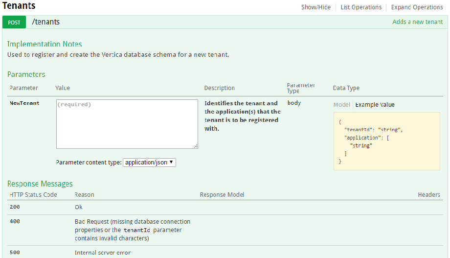

# Audit Management Web Service

In order to use CAF Auditing in an application, the auditing events that the application uses must be specified along with the parameters that are associated with each of the events in an [Audit Event Definition File](https://github.hpe.com/caf/caf-audit-schema/blob/develop/README.md).

The CAF Audit Management Web Service API provides a set of endpoints to facilitate the registration of these application defined audit events and the creation of tenants within an application.

The **POST /applications** endpoint is used to register audit events used by each application defined in the Audit Event Definition File. This initializes the Vertica database with a set of management tables which are created under a schema named AuditManagement.

The **POST /tenants** endpoint is used to add new tenants. One or more applications can be specified when adding a new tenant. This will result in application specific storage tables being created under tenant specific schemas in the Vertica database. The Kafka topic representing the feed of audit event messages for the tenant is also associated with the pre-configured Vertica scheduler as part of this operation.

## Deployment

This is available as a Docker container with Apache Tomcat - see [caf-audit-management-service-container](https://github.hpe.com/caf/caf-audit-management-service-container)

## Using the Audit Management Web Service

To start using the web service, the endpoints can be exercised by accessing the Web UI at the following URL:

	http://<docker.ip.address>:<port>/caf-audit-management-ui

Replace `<docker.ip.address>` and `<port>` as necessary.

### Loading the XML Audit Events File

Applications will define audit events that will occur in the system in an Audit Event Definition File. This file can then be registered using the /applications endpoint as shown in the screenshot below:

#### Verification Instructions

When the first application events file is registered, this operation will configure the Vertica database with audit management tables to record both the application specific audit events XML as well as tenants added through the service. See tables ApplicationEvents and TenantApplications under the AuditManagement schema in the Vertica database. An entry in the ApplicationEvents table will also be created to register the application events XML supplied.

Any further calls to load other application events XML will result in additional rows being added to the ApplicationEvents table only.

### Adding Tenants

Once applications have been registered, tenants can then be added using the /tenants endpoint. The tenant and application identifiers need supplied in the call to this endpoint.

#### Verification Instructions

Every time a new tenant is added, a new row is inserted into the TenantApplications table under the AuditManagement database schema.

Two new tenant specific database schemas are then created for the tenant in the Vertica database which comprise a number of tables. See [Auditing Database Tables](https://github.hpe.com/caf/caf-audit-management-service-container/blob/develop/documentation/auditing-database-tables.md). If the client-side auditing library has sent audit events messages for this tenant through to the Kafka messaging service, this audit event data should start to arrive in the application specific audit events table under the tenant specific schema created as part of the add tenant web service call.
