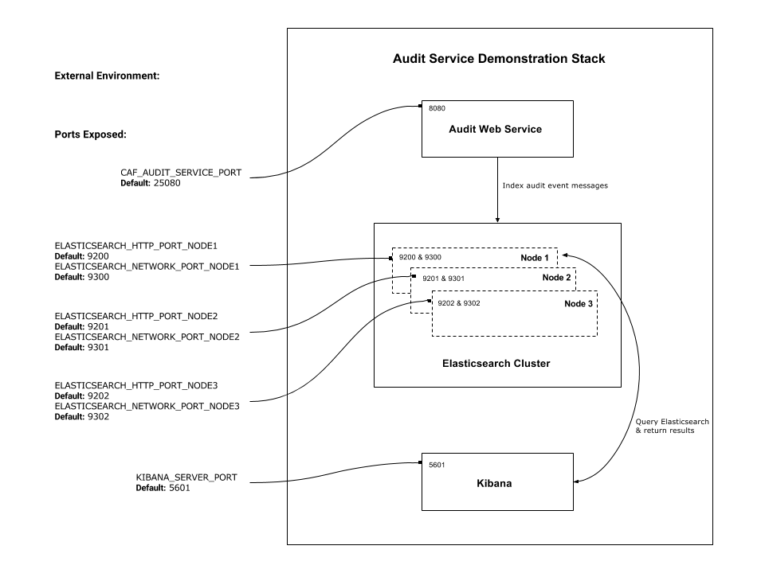

## Audit Service Deployment

### Introduction

The Audit Service is designed to provide auditing of user and system actions by defining the required events and the information associated with each event. An application audit event definition file can be used to generate an application-specific, client-side auditing library. The Audit service is multi-tenant aware. Applications send events using the generated client-side auditing library to Elasticsearch where they are indexed according to each tenant.

### Deployment Repository

This repository provides the necessary files to easily get started using the Audit Service.

The only pre-requisite required to get started is that Docker must be available on the system.

The deployment files are in Docker Compose v3 format, and they are compatible with both Docker Compose and Docker Stack.

As well as the Audit Web Service, the deployment file also references Elasticsearch.

### Demonstration

The Docker Compose file contains the following services:

1. **Audit Web Service**  
    This is a RESTful Web Service and provides a simple API. It can be used to index audit event messages into Elasticsearch. Each audit event message will comprise a set of fields including the application identifier, the user that triggered the audit event as well as the tenant that the user belongs to.

    By default, port 25080 is used to communicate with the Audit Web Service but if that port is not available then the `CAF_AUDIT_SERVICE_PORT` environment variable can be set to have a different port used.

2. **Elasticsearch Cluster**  
    [Elasticsearch](https://www.elastic.co/products/elasticsearch) is a search engine based on [Lucene](https://lucene.apache.org/core/). It provides a distributed, multi-tenant capable full-text search engine with an HTTP web interface and schema-free JSON documents. Elasticsearch is developed in Java and is released as open source under the terms of the Apache License.

    By default, ports 9200 (i.e. HTTP port) and 9300 (i.e. network communication port) are used on Node 1 of the Elasticsearch cluster.

    By default, ports 9201 and 9301 are used on Node 2 of the Elasticsearch cluster.

    By default, ports 9202 and 9302 are used on Node 3 of the Elasticsearch cluster.
 
### Usage

1. Download the files from this repository  
You can clone this repository using Git or else you can simply download the files as a Zip using the following link:  
[https://github.com/CAFAudit/audit-service-deploy/archive/develop.zip](https://github.com/CAFAudit/audit-service-deploy/archive/develop.zip)

2. Configure the external parameters if required  
The following parameters may be set:

    <table>
      <tr>
        <th>Environment Variable</th>
        <th>Default</th>
        <th>Description</th>
      </tr>
      <tr>
        <td>ES_JAVA_OPTS</td>
        <td>&#8209Xmx256m&nbsp;&#8209Xms256m</td>
        <td>Environment variable to set heap size  e.g. to use 1GB use ES_JAVA_OPTS="-Xms1g -Xmx1g"</td>
      </tr>
      <tr>
        <td>ELASTICSEARCH_HTTP_PORT_NODE1</td>
        <td>9200</td>
        <td>HTTP Port used for RESTful API on Node1</td>
      </tr>
      <tr>
        <td>ELASTICSEARCH_NETWORK_PORT_NODE1</td>
        <td>9300</td>
        <td>Network Communication Port used for Java API, the Elasticsearch transport protocol and Cluster Communications on Node1</td>
      </tr>
      <tr>
        <td>ELASTICSEARCH_HTTP_PORT_NODE2</td>
        <td>9201</td>
        <td>HTTP Port used for RESTful API on Node2</td>
      </tr>
      <tr>
        <td>ELASTICSEARCH_NETWORK_PORT_NODE2</td>
        <td>9301</td>
        <td>Network Communication Port used for Java API, the Elasticsearch transport protocol and Cluster Communications on Node2</td>
      </tr>
      <tr>
        <td>ELASTICSEARCH_HTTP_PORT_NODE3</td>
        <td>9202</td>
        <td>HTTP Port used for RESTful API on Node3</td>
      </tr>
      <tr>
        <td>ELASTICSEARCH_NETWORK_PORT_NODE3</td>
        <td>9302</td>
        <td>Network Communication Port used for Java API, the Elasticsearch transport protocol and Cluster Communications on Node3</td>
      </tr>
      <tr>
        <td>CAF_AUDIT_SERVICE_PORT</td>
        <td>25080</td>
        <td>This is the port that the Audit Web Service is configured to listen on.</td>
      </tr>
    </table>

3. Deploy the services  
First navigate to the folder where you have downloaded the files to and then run one of the following commands, depending on whether you are using Docker Compose or Docker Stack:

    <table>
      <tr>
        <td><b>Docker Compose</b></td>
        <td>
            docker-compose up  <small>(docker-compose defaults to use a file called <i><b>docker-compose.yml</b></i>)</small> 
            docker-compose up -d <small>(<i><b>-d</b></i> flag is for "detached mode" i.e. run containers in the background)</small>
        </td>
      </tr>
      <tr>
        <td><b>Docker Stack</b></td>
        <td>docker stack deploy --compose-file=docker-compose.yml auditservicedemo</td>
      </tr>
    </table>

4. Navigate to the Audit Web Service UI  
    The Audit Web Service is a RESTful Web Service and is primarily intended for programmatic access, however it also ships with a Swagger-generated user-interface.

    Using a browser, navigate to the `/caf-audit-service-ui` endpoint on the Audit Web Service:  

        http://<DOCKER_HOST>:25080/caf-audit-service-ui

    Replace `<DOCKER_HOST>` with the name of your own Docker Host and adjust the port if you are not using the default.

5. Index an audit event message into Elasticsearch  
    Go to the `POST /auditevents` operation.

    - Enter the following audit event message details into the `newAuditEvent` parameter:

			{
			  "applicationId": "SampleApp",
			  "processId": "77baef40-2744-46ab-9b69-a349a19930c5",
			  "threadId": 1,
			  "eventOrder": 1,
			  "eventTime": "2017-05-16T12:16:11.174Z",
			  "eventTimeSource": "myHostName",
			  "userId": "test_user",
			  "tenantId": "test_tenant",
			  "correlationId": "test123",
			  "eventTypeId": "viewDocument",
			  "eventCategoryId": "documentEvents",
			  "eventParams": [
			  {
			    "paramName": "docId",
			    "paramType": "long",
			    "paramValue": "123"
			  } ]
			}

	- Click on the 'Try it out!' button.

6. Retrieve the audit event message  
    `curl -XGET '<DOCKER_HOST>:<ELASTICSEARCH_HTTP_PORT>/<index>/_search?q=userId:<userId>&pretty'`  
    i.e. `curl -XGET 'localhost:9200/test_tenant_audit/_search?q=userId:test_user&pretty'`  
  
    Response:  

		{
		  "took" : 33,
		  "timed_out" : false,
		  "_shards" : {
		    "total" : 5,
		    "successful" : 5,
		    "failed" : 0
		  },
		  "hits" : {
		    "total" : 1,
		    "max_score" : 0.2876821,
		    "hits" : [
		      {
		        "_index" : "test_tenant_audit",
		        "_type" : "cafAuditEvent",
		        "_id" : "AVwQeJ05uf04cpVnLlCF",
		        "_score" : 0.2876821,
		        "_source" : {
		          "threadId" : 1,
		          "eventTypeId" : "viewDocument",
		          "processId" : "77baef40-2744-46ab-9b69-a349a19930c5",
		          "eventTime" : "2017-05-16T12:16:11.174Z",
		          "eventTimeSource" : "myHostName",
		          "correlationId" : "test123",
		          "applicationId" : "SampleApp",
		          "eventOrder" : 1,
		          "userId" : "test_user",
		          "eventCategoryId" : "documentEvents",
		          "docId_CALng" : 123
		        }
		      }
		    ]
		  }
		}

### Override Files
Docker Compose supports the concept of override files which can be used to modify the service definitions in the main Docker Compose files, or to add extra service definitions.

The following override files are supplied alongside the main Docker Compose file for the service:

<table>
  <tr>
    <th>Override File</th>
    <th>Description</th>
  </tr>
  <tr>
    <td>docker&#8209;compose.https.yml</td>
    <td>This override file can be used to activate a HTTPS port in the Audit Web Service which can be used for secure communication.

    

    You must provide a keystore file either at the default path (./keystore/.keystore) or a custom path and set the <code>CAF_AUDIT_SERVICE_KEYSTORE</code> environment variable.

    

    The default port exposed for HTTPS communication is 25081 but this can be overridden by supplying the environment variable <code>CAF_AUDIT_SERVICE_PORT_HTTPS</code>.
	

    Additional environment variables can be supplied if the keystore file has been generated using custom values for alias, keystore and key passwords.</td>
  </tr>
</table>

#### Activating HTTPS Endpoint

The `docker-compose.https.yml` override file should be used to activate a HTTPS endpoint for secure communication with the Audit Web Service.

##### Create the Keystore
First of all, you need to generate a keystore file. For more information on generating keystores see these [instructions](https://tomcat.apache.org/tomcat-7.0-doc/ssl-howto.html).

A default keystore can be generated using the following command. Specify `changeit` when asked for both the keystore and key passwords.

	keytool -genkey -alias tomcat -keystore .keystore -keyalg RSA

If you generate a keystore with custom passwords instead, then make sure to provide environment variables `CAF_AUDIT_SERVICE_KEYSTORE_PASS` and `CAF_AUDIT_SERVICE_KEY_PASS` (see override options below).

##### Deploy the Keystore
The generated keystore file then needs placed in a folder called `keystore` in audit-service-deploy. Name it `.keystore` or else provide your own custom path by setting `CAF_AUDIT_SERVICE_KEYSTORE` (e.g. `./mykeystore/ks.p12`).

##### Activate
The override file, `docker-compose.https.yml`, needs applied in order to activate the HTTPS endpoint. Run the following command:

    docker-compose -f docker-compose.yml -f docker-compose.https.yml up

##### Override Options
The following table outlines the additional overrides supported in the `docker-compose.https.yml` file:

<table>
  <tr>
    <th>Environment Variable</th>
    <th>Default</th>
    <th>Description</th>
  </tr>
  <tr>
    <td>CAF_AUDIT_SERVICE_PORT_HTTPS</td>
    <td>25081</td>
    <td>This is the HTTPS port to be exposed in the Audit Web Service to allow secure communication. Unless a keystore is provided, the HTTPS port will not be active.</td>
  </tr>
  <tr>
    <td>CAF_AUDIT_SERVICE_KEYSTORE</td>
    <td>./keystore/.keystore</td>
    <td>If you are activating the HTTPS port, you can override the default keystore location to provide your own keystore as a volume. This is the path of the keystore file (i.e. <code>./mykeystore/ks.p12</code>).</td>
  </tr>
  <tr>
    <td>CAF_AUDIT_SERVICE_KEYSTORE_ALIAS</td>
    <td>tomcat</td>
    <td>If you generated your own keystore with a custom keystore alias, use this environment variable to update the Audit Web Service's keystore configuration in the <code>server.xml</code>. The default is "tomcat".</td>
  </tr>
  <tr>
    <td>CAF_AUDIT_SERVICE_KEYSTORE_PASS</td>
    <td>changeit</td>
    <td>If you generated your own keystore with a custom keystore password, use this environment variable to update the Audit Web Service's keystore configuration in the <code>server.xml</code>. The default is "changeit".</td>
  </tr>
  <tr>
    <td>CAF_AUDIT_SERVICE_KEY_PASS</td>
    <td>changeit</td>
    <td>If you generated your own keystore with a custom key password, use this environment variable to update the Audit Web Service's keystore configuration in the <code>server.xml</code>. The default is "changeit".</td>
  </tr>
</table>

### Troubleshooting

#### Errors during Start Up

If the following error appears during start up and the Elasticsearch container shuts down shortly after start up:
> elasticsearch1  | ERROR: bootstrap checks failed  
> elasticsearch1  | max virtual memory areas vm.max_map_count [65530] is too low, increase to at least [262144]

This error can be resolved by issuing the following command on the Linux host:  
* `sudo sysctl -w vm.max_map_count=262144`

More information regarding `vm.max_map_count` can be found in the Elasticsearch official Documentation [here](https://www.elastic.co/guide/en/elasticsearch/reference/current/docker.html#docker-cli-run-prod-mode) and [here](https://www.elastic.co/guide/en/elasticsearch/reference/current/vm-max-map-count.html).

#### Warnings during Start Up

If the following warning is seen during start up it can be disregarded:
> audit_elasticsearch | [2017-04-14T09:20:02,597][WARN ][i.n.u.i.MacAddressUtil   ] Failed to find a usable hardware address from the network interfaces; using random bytes: 1a:e1:8d:83:20:f5:d0:3c

More information can be found [here](https://discuss.elastic.co/t/es-5-2-0-in-kvm-netty-warning-failed-to-find-a-usable-hardware-address-from-the-network-interfaces/73717/3)
 
