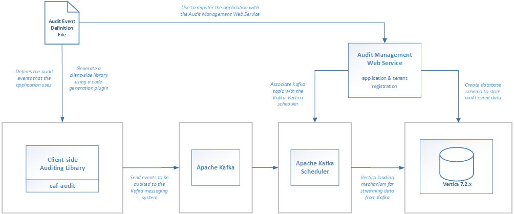

# Overview

Applications will define audit events that will occur in the system in an Audit Event Definition File.
The Audit Event Definition File will be used to generate an application-specific client-side auditing library using a custom maven plugin. The client-side library is then used to send audit event messages to the Apache Kafka messaging service.
The Audit Event Definition File will also be used to register the application with the Audit Management Web Service. The web service will set up Vertica to store the audit events.
Vertica provides a high-performance loading mechanism for streaming the data from Apache Kafka into the Vertica database via Kafka Schedulers. This loading mechanism is configured and started when tenants are registered with the application using the Audit Management Web Service.
For set-up:
1. Define audit events in an Audit Event Definition File.
2. Generate the client-side auditing library using the Audit Event Definition File and code generation plugin.
3. Install and configure Apache Kafka on a system.
4. It is recommended, that you install and configure Vertica 7.2.x on a separate machine.
5. Register the application and add tenant(s) with the Audit Management Web Service. This will create the necessary database schema in Vertica. It will also configure the Kafka integration feature in order to stream the data from the Kafka messaging service into the Vertica database.
6. Use the client-side auditing library to send audit events to Kafka.

# Auditing Library

This project builds a library that sends audit events to Apache Kafka. Application specific auditing libraries generated with the [code generation plugin](https://github.hpe.com/caf/caf-audit-maven-plugin) use this to send  their events.

## Generating a Client-side Auditing Library

In order to use CAF Auditing you must first define the audit events in an [Audit Event Definition File](https://github.hpe.com/caf/caf-audit-schema/blob/develop/README.md). After you have created the definition file you can use it to generate a client-side library to make it easier to raise the defined audit events.

Technically you do not need to generate a client-side library in order to use CAF Auditing; you could use the `caf-audit` module directly, but generating a client-side library should make it easier and safer to raise events, as it should mean that each event can be raised with a single type-safe call.

Here is a sample Maven project file that generates a client-side auditing library:

	<?xml version="1.0" encoding="UTF-8"?>
	<project xmlns="http://maven.apache.org/POM/4.0.0"
	         xmlns:xsi="http://www.w3.org/2001/XMLSchema-instance"
	         xsi:schemaLocation="http://maven.apache.org/POM/4.0.0 http://maven.apache.org/xsd/maven-4.0.0.xsd">
	    <modelVersion>4.0.0</modelVersion>
	
	    <groupId>com.hpe.sampleapp</groupId>
	    <artifactId>sampleapp-audit</artifactId>
	    <version>1.0-SNAPSHOT</version>
	
	    <properties>
	        <project.build.sourceEncoding>UTF-8</project.build.sourceEncoding>
	        <maven.compiler.source>1.8</maven.compiler.source>
	        <maven.compiler.target>1.8</maven.compiler.target>
	    </properties>
	
	    <dependencies>
	        <dependency>
	            <groupId>com.hpe.caf</groupId>
	            <artifactId>caf-audit</artifactId>
	            <version>1.1</version>
	        </dependency>
	    </dependencies>
	
	    <build>
	        <plugins>
	            <plugin>
	                <groupId>com.hpe.caf</groupId>
	                <artifactId>caf-audit-maven-plugin</artifactId>
	                <version>1.0</version>
	                <executions>
	                    <execution>
	                        <id>generate-code</id>
	                        <phase>generate-sources</phase>
	                        <goals>
	                            <goal>xmltojava</goal>
	                        </goals>
	                    </execution>
	                </executions>
	                <configuration>
	                    <auditXMLConfig>src/main/xml/sampleapp-auditevents.xml</auditXMLConfig>
	                    <packageName>${project.groupId}.auditing</packageName>
	                </configuration>
	            </plugin>
	        </plugins>
	    </build>
	
	    <pluginRepositories>
	        <pluginRepository>
	            <id>cmbg-maven-releases</id>
	            <name>Cambridge Nexus Releases</name>
	            <url>http://cmbg-maven.autonomy.com/nexus/content/repositories/releases</url>
	            <snapshots>
	                <enabled>false</enabled>
	            </snapshots>
	        </pluginRepository>
	    </pluginRepositories>
	</project>

### Maven Coordinates

Like any other Maven project, the client-side auditing library must be assigned unique coordinates that can by used to reference it.

	<groupId>com.hpe.sampleapp</groupId>
	<artifactId>sampleapp-audit</artifactId>
	<version>1.0-SNAPSHOT</version>

### Dependencies

The generated library will have a dependency on `caf-audit`, which the generated code will use to raise the audit events. This dependency of course may introduce indirect transitive dependencies; these dependencies don't need to be directly referenced as the generated code only uses types defined in the `caf-audit` library.

	<dependencies>
	    <dependency>
	        <groupId>com.hpe.caf</groupId>
	        <artifactId>caf-audit</artifactId>
	        <version>1.1</version>
	    </dependency>
	</dependencies>

### Code Generation Plugin

The `xmltojava` goal of the [code generation plugin](https://github.hpe.com/caf/caf-audit-maven-plugin) is used to generate the Java auditing code that will make up the library. The `auditXMLConfig` setting can be used to define the path to the Audit Event Definition file, and the `packageName` setting can be used to set the package in which the auditing code should be generated.

	<build>
	    <plugins>
	        <plugin>
	            <groupId>com.hpe.caf</groupId>
	            <artifactId>caf-audit-maven-plugin</artifactId>
	            <version>1.0</version>
	            <executions>
	                <execution>
	                    <id>generate-code</id>
	                    <phase>generate-sources</phase>
	                    <goals>
	                        <goal>xmltojava</goal>
	                    </goals>
	                </execution>
	            </executions>
	            <configuration>
	                <auditXMLConfig>src/main/xml/sampleapp-auditevents.xml</auditXMLConfig>
	                <packageName>${project.groupId}.auditing</packageName>
	            </configuration>
	        </plugin>
	    </plugins>
	</build>

In this example the Audit Event Definition file is in the `src/main/xml/` folder, though of course it could be read from any folder. The name of the package to use is being built up by appending `.auditing` to the project's group identifier (i.e. `com.hpe.sampleapp` in this example).

### Plugin Repositories

Depending on how your Maven settings.xml file is configured, the pluginRepositories section may or may not be required in order to locate the code generation plugin.

	<pluginRepositories>
	    <pluginRepository>
	        <id>cmbg-maven-releases</id>
	        <name>Cambridge Nexus Releases</name>
	        <url>http://cmbg-maven.autonomy.com/nexus/content/repositories/releases</url>
	        <snapshots>
	            <enabled>false</enabled>
	        </snapshots>
	    </pluginRepository>
	</pluginRepositories>

In this example the URL is set to [http://cmbg-maven.autonomy.com/nexus/content/repositories/releases](http://cmbg-maven.autonomy.com/nexus/content/repositories/releases), but if that location is inaccessible then you could try one of the following URLs instead:

- [http://rh7-artifactory.hpswlabs.hp.com:8081/artifactory/policyengine-release](http://rh7-artifactory.hpswlabs.hp.com:8081/artifactory/policyengine-release)
- [http://16.26.25.50/nexus/content/repositories/releases](http://16.26.25.50/nexus/content/repositories/releases)
- [http://16.103.3.109:8081/artifactory/policyengine-release](http://16.103.3.109:8081/artifactory/policyengine-release)

### No-op Auditing Library

A dummy implementation of the standard auditing library, `caf-audit`, is also provided to support developers without any Apache Kafka infrastructure. It has the same interface as the standard auditing library but does not send anything to Kafka. This will allow developers to continue to work with their application without the need to install and configure Apache Kafka.

In order to make use of this no-op auditing library, modify the Maven coordinates for the `caf-audit` dependency and specify 1.1-NOOP as the version rather than just 1.1:

	<dependencies>
	    <dependency>
	        <groupId>com.hpe.caf</groupId>
	        <artifactId>caf-audit</artifactId>
	        <version>1.1-NOOP</version>
	    </dependency>
	</dependencies>

Alternatively, you could do something more custom at runtime where you replace the standard auditing library jar with the no-op version if you prefer.

### String Validation

The standard auditing library, `caf-audit`, performs string validation on audit events through the `AuditValidator` object. This applies only to string data where the audit event parameter has been configured with minimum and/or maximum length constraints in the [Audit Event Definition File](https://github.hpe.com/caf/caf-audit-schema/blob/develop/README.md). Where a `MinLength` constraint has been defined, validation will fail if the length of the given string is less than this number. Where a `MaxLength` constraint has been defined, validation will fail if the length of the given string is greater than this number.

## Using a Client-side Auditing Library

### Dependencies

A generated client-side library should be referenced in the normal way in the application's POM file. You shouldn't need to manually add a dependency on `caf-audit` as it will be a transitive dependency of the generated library.

	<dependency>
	    <groupId>com.hpe.sampleapp</groupId>
	    <artifactId>sampleapp-audit</artifactId>
	    <version>1.0-SNAPSHOT</version>
	</dependency>

### Audit Connection

Regardless of whether you choose to use a generated client-side library, or to use `caf-audit` directly, you must first create an `AuditConnection` object.

This object represents a logical connection to the persistent storage (i.e. to Kafka in the current implementation). It is a thread-safe object. It should be considered that this object takes some time to construct, so the application should hold on to it and re-use it rather than constantly re-constructing it.

The `AuditConnection` object can be constructed using the static `createConnection()` method in the `AuditConnectionFactory` class. This method takes a `ConfigurationSource` parameter, which is the standard method of configuration in CAF.

### Configuration in CAF

You may already have a CAF Configuration Source in your application. It is a general framework that abstracts away the source of the configuration, allowing it to come from environment variables, files, a REST service, or potentially a custom source which better integrates with the host application.
If you're not already using CAF's Configuration mechanism, then here is some sample code to generate a ConfigurationSource object.

	import com.hpe.caf.api.*;
	import com.hpe.caf.cipher.NullCipherProvider;
	import com.hpe.caf.config.system.SystemBootstrapConfiguration;
	import com.hpe.caf.naming.ServicePath;
	import com.hpe.caf.util.ModuleLoader;
	
	public static ConfigurationSource createCafConfigSource() throws Exception
	{
	    System.setProperty("CAF_CONFIG_PATH", "/etc/sampleapp/config");
	    System.setProperty("CAF_APPNAME", "sampleappgroup/sampleapp");
	
	    BootstrapConfiguration bootstrap = new SystemBootstrapConfiguration();
	    Cipher cipher = ModuleLoader.getService(CipherProvider.class, NullCipherProvider.class).getCipher(bootstrap);
	    ServicePath path = bootstrap.getServicePath();
	    Codec codec = ModuleLoader.getService(Codec.class);
	    return ModuleLoader.getService(ConfigurationSourceProvider.class).getConfigurationSource(bootstrap, cipher, path, codec);
	}

To compile the above sample code you will need to add the following dependencies to your POM:

	<dependency>
	    <groupId>com.hpe.caf</groupId>
	    <artifactId>caf-api</artifactId>
	    <version>10.0</version>
	</dependency>
	<dependency>
	    <groupId>com.hpe.caf.cipher</groupId>
	    <artifactId>cipher-null</artifactId>
	    <version>10.0</version>
	</dependency>
	<dependency>
	    <groupId>com.hpe.caf.config</groupId>
	    <artifactId>config-system</artifactId>
	    <version>10.0</version>
	</dependency>
	<dependency>
	    <groupId>com.hpe.caf.util</groupId>
	    <artifactId>util-moduleloader</artifactId>
	    <version>1.0</version>
	</dependency>
	<dependency>
	    <groupId>com.hpe.caf.util</groupId>
	    <artifactId>util-naming</artifactId>
	    <version>1.0</version>
	</dependency>

To use JSON-encoded files for your configuration you will need to add the following additional dependencies to your POM:

	<!-- Runtime-only Dependencies -->
	<dependency>
	    <groupId>com.hpe.caf.config</groupId>
	    <artifactId>config-file</artifactId>
	    <version>10.0</version>
	    <scope>runtime</scope>
	</dependency>
	<dependency>
	    <groupId>com.hpe.caf.codec</groupId>
	    <artifactId>codec-json</artifactId>
	    <version>10.1</version>
	    <scope>runtime</scope>
	</dependency>
	<dependency>
	    <groupId>io.dropwizard</groupId>
	    <artifactId>dropwizard-core</artifactId>
	    <version>0.8.4</version>
	    <scope>runtime</scope>
	</dependency>

### Configuration Required to create the AuditConnection

In the above sample CAF Configuration is using JSON-encoded files with the following parameters:

	CAF_CONFIG_PATH: /etc/sampleapp/config
	CAF_APPNAME: sampleappgroup/sampleapp

Given this configuration, to configure CAF Auditing you should create a file named `cfg_sampleappgroup_sampleapp_KafkaAuditConfiguration` in the `/etc/sampleapp/config/` directory. The contents of this file should be similar to the following:

	{
	    "bootstrapServers": "192.168.56.20:9092",
	    "acks": "all",
	    "retries": "0"
	}

`bootstrapServers` refers to one or more of the nodes of the Kafka cluster.
`acks` is the number of nodes in the cluster which must acknowledge an audit event when it is sent.

### Audit Channel

After you have successfully constructed an `AuditConnection` object you must construct an `AuditChannel` object.

This object represents a logical channel to the persistent storage (i.e. to Kafka in the current implementation). It is NOT a thread-safe object so it must not be shared across threads without synchronisation. However there is no issue constructing multiple `AuditChannel` objects simultaneously on different threads, and the objects are lightweight so caching them is not that important.

The `AuditChannel` object can be constructed using the `createChannel()` method on the `AuditConnection object`. It does not take any parameters.

### Audit Log

The generated library contains an `AuditLog class` which contains static methods which can be used to log audit events.

Here is an example prototype for a `viewDocument` event which takes a single document identifier parameter:

	public static void auditViewDocument
	(
	    AuditChannel channel,
	    String tenantId,
	    String userId,
	    String correlationId,
	    long docId
	) throws Exception;

The name of the event is included in the generated method name. In addition to the custom parameters (document id in this case), the caller must pass the `AuditChannel` object to be used, as well as the tenant id, user id, and correlation id.

The method will throw an Exception if the audit event could not be stored for some reason (e.g. network failure).