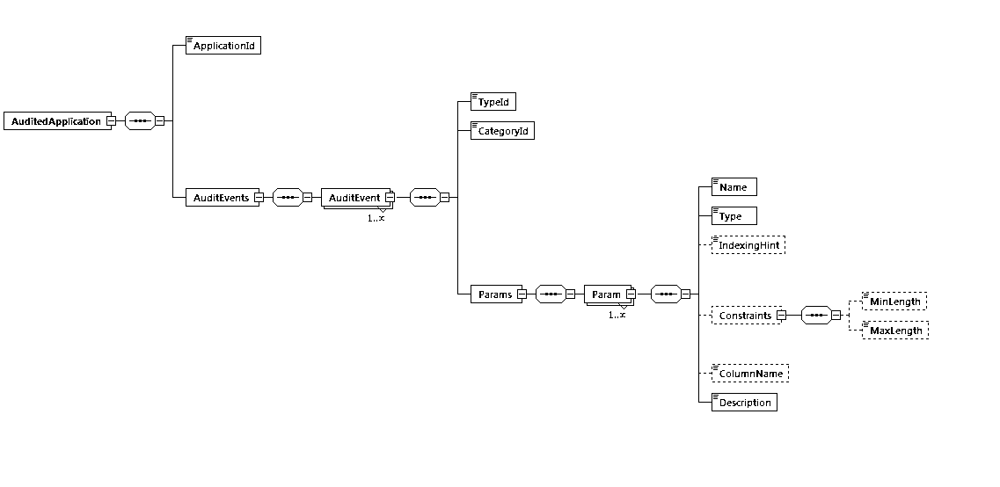

# Audit Event Definition Schema

In order to use CAF Auditing in an application, the auditing events that the application uses must be specified along with the parameters that are associated with each of the events. These events are specified in an Audit Event Definition File. 

This project contains the exact XML Schema file that the Audit Event Definition File must adhere to.

## Audit Event Definition File

An example of an Audit Event Definition File is shown next:

	<?xml version="1.0" encoding="UTF-8"?>
	<AuditedApplication xmlns="http://www.hpe.com/CAF/Auditing/Schema/AuditedApplication.xsd"
	                    xmlns:xsi="http://www.w3.org/2001/XMLSchema-instance"
	                    xsi:schemaLocation="http://www.hpe.com/CAF/Auditing/Schema/AuditedApplication.xsd https://raw.githubusercontent.com/CAFAudit/audit-service/v3.0.0/caf-audit-schema/src/main/resources/schema/AuditedApplication.xsd">
	  <ApplicationId>SampleApp</ApplicationId>
	  <AuditEvents>
	    <AuditEvent>
	      <TypeId>viewDocument</TypeId>
	      <CategoryId>documentEvents</CategoryId>
	      <Params>
	        <Param>
                <Name>docId</Name>
                <Type>long</Type>
                <Description>Document Identifier</Description>
	        </Param>
	      </Params>
	    </AuditEvent>
	    <AuditEvent>
	      <TypeId>deleteDocument</TypeId>
	      <CategoryId>documentEvents</CategoryId>
	      <Params>
	        <Param>
                <Name>docId</Name>
                <Type>long</Type>
                <Description>Document Identifier</Description>
	        </Param>
	        <Param>
                <Name>authorisedBy</Name>
                <Type>string</Type>
                <IndexingHint>keyword</IndexingHint>
                <Constraints>
                    <MinLength>1</MinLength>
                    <MaxLength>256</MaxLength>
                </Constraints>
                <Description>User who authorised the deletion</Description>
	        </Param>
	      </Params>
	    </AuditEvent>
	  </AuditEvents>
	</AuditedApplication>

### Description

`AuditedApplication` is the root element.

`ApplicationId` identifies the application that the Audit Events are associated with.

For each Audit Event defined, `TypeId` is a string identifier for the particular event (e.g. viewDocument) and 
`CategoryId` is a string identifier for the category of the event.

A list of parameter elements are then defined for each Audit Event. This includes the `Name` of the parameter, the `Type` (i.e. string, short, int, long, float, double, boolean or date) and the `Description`. The `IndexingHint` (i.e. fulltext or keyword) is optional and can be used to specify an indexing hint when storing audit event parameter data of `Type` string. The `Constraints` element is also optional and this can be used to specify minimum and/or maximum length constraints for audit event parameters of `Type` string. The `ColumnName` element too is optional which can be used to force the use of a particular database column when storing the audit data.

## Using the Schema File

If you reference the XML Schema file from your Audit Event Definition File then you should be able to use the Validate functionality that is built into most IDEs and XML Editors. This will allow you to easily check for syntax errors in your Audit Event Definition File. To do this add the standard `xsi:schemaLocation` attribute to the root `AuditedApplication` element.

Change the `AuditedApplication` element from:

	<AuditedApplication xmlns="http://www.hpe.com/CAF/Auditing/Schema/AuditedApplication.xsd">

to:

	<AuditedApplication xmlns="http://www.hpe.com/CAF/Auditing/Schema/AuditedApplication.xsd"
	                    xmlns:xsi="http://www.w3.org/2001/XMLSchema-instance"
	                    xsi:schemaLocation="http://www.hpe.com/CAF/Auditing/Schema/AuditedApplication.xsd https://raw.githubusercontent.com/CAFAudit/audit-service/v3.0.0/caf-audit-schema/src/main/resources/schema/AuditedApplication.xsd">

Many IDEs and XML Editors will also use the schema file to provide IntelliSense and type-ahead when the definition file is being authored.
