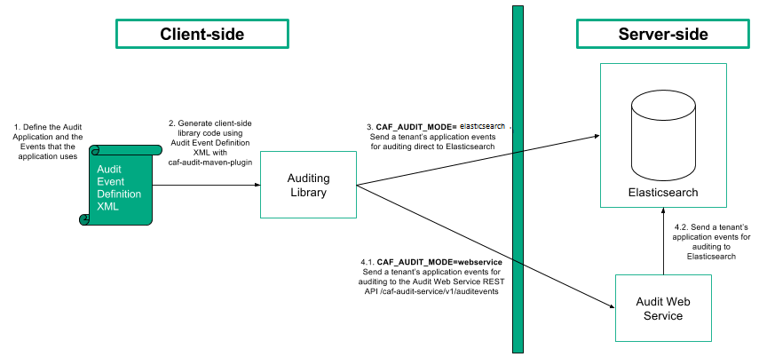
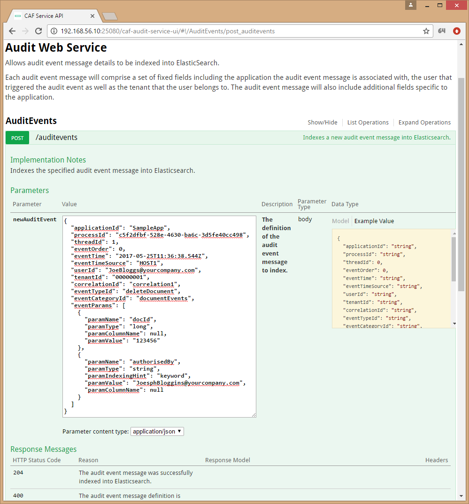

# Overview

Applications will define audit events that will occur in the system in an [Audit Event Definition File](../caf-audit-schema/README.md).
The Audit Event Definition File will be used to generate an application-specific client-side auditing library using a custom maven plugin.

For set-up:

1. Use the [Audit Service Deploy Project](https://github.com/CAFAudit/audit-service-deploy), to launch the Audit Web Service and Elasticsearch.
2. Define an application's audit events in an Audit Event Definition File.
3. Generate the client-side auditing library using the audit event definition file and the code generation plugin. 
4. In your application, use the client-side auditing library to send audit events to directly to Elasticsearch or via the Audit Web Service.

# Auditing Library

This project builds a library that sends audit events to directly to Elasticsearch or via the Audit Web Service API.

Application specific auditing libraries generated with the [code generation plugin](../caf-audit-maven-plugin) use the Auditing library to send their events.

## Generating a Client-side Auditing Library

In order to use CAF Auditing you must first define the audit events in an [Audit Event Definition File](../caf-audit-schema/README.md). After you have created the definition file you can use it to generate a client-side library to make it easier to raise the defined audit events.

Technically you do not need to generate a client-side library in order to use CAF Auditing; you could use the `caf-audit` module directly, but generating a client-side library should make it easier and safer to raise events, as it should mean that each event can be raised with a single type-safe call.

Here is a sample Maven project file that generates a client-side auditing library:

	<?xml version="1.0" encoding="UTF-8"?>
	<project xmlns="http://maven.apache.org/POM/4.0.0"
         xmlns:xsi="http://www.w3.org/2001/XMLSchema-instance"
         xsi:schemaLocation="http://maven.apache.org/POM/4.0.0 http://maven.apache.org/xsd/maven-4.0.0.xsd">
	    <modelVersion>4.0.0</modelVersion>
	
	    <groupId>com.hpe.sampleapp</groupId>
	    <artifactId>sampleapp-audit</artifactId>
	    <version>1.0.0-SNAPSHOT</version>
	
	    <properties>
	        <project.build.sourceEncoding>UTF-8</project.build.sourceEncoding>
	        <maven.compiler.source>1.8</maven.compiler.source>
	        <maven.compiler.target>1.8</maven.compiler.target>
	    </properties>
	
	    <dependencies>
	        <dependency>
	            <groupId>com.github.cafaudit</groupId>
	            <artifactId>caf-audit</artifactId>
	            <version>3.1.0</version>
	        </dependency>
	    </dependencies>
	
	    <build>
	        <plugins>
	            <plugin>
	                <groupId>com.github.cafaudit</groupId>
	                <artifactId>caf-audit-maven-plugin</artifactId>
	                <version>3.1.0</version>
	                <executions>
	                    <execution>
	                        <id>generate-code</id>
	                        <phase>generate-sources</phase>
	                        <goals>
	                            <goal>xmltojava</goal>
	                        </goals>
	                    </execution>
	                </executions>
	                <configuration>
	                    <auditXMLConfig>src/main/xml/sampleapp-auditevents.xml</auditXMLConfig>
	                    <packageName>${project.groupId}.auditing</packageName>
	                </configuration>
	            </plugin>
	        </plugins>
	    </build>
	</project>

### Maven Coordinates

Like any other Maven project, the client-side auditing library must be assigned unique coordinates that can by used to reference it.

	<groupId>com.hpe.sampleapp</groupId>
	<artifactId>sampleapp-audit</artifactId>
	<version>1.0.0-SNAPSHOT</version>

### Dependencies

The generated library will have a dependency on `caf-audit`, which the generated code will use to raise the audit events. This dependency of course may introduce indirect transitive dependencies; these dependencies don't need to be directly referenced as the generated code only uses types defined in the `caf-audit` library.

	<dependencies>
	    <dependency>
	        <groupId>com.github.cafaudit</groupId>
	        <artifactId>caf-audit</artifactId>
	        <version>3.1.0</version>
	    </dependency>
	</dependencies>

### Code Generation Plugin

The `xmltojava` goal of the [code generation plugin](../caf-audit-maven-plugin) is used to generate the Java auditing code that will make up the library. The `auditXMLConfig` setting can be used to define the path to the Audit Event Definition file, and the `packageName` setting can be used to set the package in which the auditing code should be generated.

	<build>
	    <plugins>
	        <plugin>
	            <groupId>com.github.cafaudit</groupId>
	            <artifactId>caf-audit-maven-plugin</artifactId>
	            <version>3.1.0</version>
	            <executions>
	                <execution>
	                    <id>generate-code</id>
	                    <phase>generate-sources</phase>
	                    <goals>
	                        <goal>xmltojava</goal>
	                    </goals>
	                </execution>
	            </executions>
	            <configuration>
	                <auditXMLConfig>src/main/xml/sampleapp-auditevents.xml</auditXMLConfig>
	                <packageName>${project.groupId}.auditing</packageName>
	            </configuration>
	        </plugin>
	    </plugins>
	</build>

In this example the Audit Event Definition file is in the `src/main/xml/` folder, though of course it could be read from any folder. The name of the package to use is being built up by appending `.auditing` to the project's group identifier (i.e. `com.hpe.sampleapp` in this example).

### String Validation

The standard auditing library, `caf-audit`, performs string validation on audit events through the `AuditValidator` object. This applies only to string data where the audit event parameter has been configured with minimum and/or maximum length constraints in the [Audit Event Definition File](../caf-audit-schema/README.md). Where a `MinLength` constraint has been defined, validation will fail if the length of the given string is less than this number. Where a `MaxLength` constraint has been defined, validation will fail if the length of the given string is greater than this number.

## Using a Client-side Auditing Library

### Dependencies

A generated client-side library should be referenced in the normal way in the application's POM file. You shouldn't need to manually add a dependency on `caf-audit` as it will be a transitive dependency of the generated library.

	<dependency>
	    <groupId>com.hpe.sampleapp</groupId>
	    <artifactId>sampleapp-audit</artifactId>
	    <version>1.0.0-SNAPSHOT</version>
	</dependency>

#### Direct to Elasticsearch Configuration  
Configuration required to be supplied via environment variable:  
- `CAF_ELASTIC_HOST_AND_PORT_VALUES`: A comma separated list of hostnames and ports to use when contacting elasticsearch. eg. localhost:9200,otherHost:9200  

- `CAF_ELASTIC_NUMBER_OF_SHARDS`: The number of shards elasticsearch is configured to use.  

- `CAF_ELASTIC_NUMBER_OF_REPLICAS`: The number of replicas configured for elasticsearch.

  The below two variables are used as an alternative configuration to support multiple hostnames format when contacting elasticsearch.

- `CAF_ELASTIC_HOST_VALUES`: A comma separated list of hostnames to use when contacting elasticsearch. eg. localhost, otherHost

- `CAF_ELASTIC_PORT_VALUE`: The REST port of the ElasticSearch server listens on. e.g. 9200

#### Audit Web Service Client Configuration 
Configuration required to be supplied via environment variable:   
- `CAF_AUDIT_WEBSERVICE_ENDPOINT_URL`: The CAF Audit webservice URL endpoint to use when issuing audit events.  

#### CAF\_AUDIT\_MODE Environment Variable  

Before passing the [`ConfigurationSource`](#configurationsource) object to the [`AuditConnectionFactory`](#auditconnectionfactory), to create an instance of the required [`AuditConnection`](#auditconnection) implementation, the `CAF_AUDIT_MODE` environment variable needs to be set appropriately to indicate the required mode. These are the following `CAF_AUDIT_MODE` environment variable options:

|           Mode           | CAF_AUDIT_MODE value |  AuditConnection Implmentation  |                          Required AuditConfiguration                          |    Implementation Binding    |  
|:------------------------:|:--------------------:|:-------------------------------:|:-----------------------------------------------------------------------------:|:------------------------------------:|  
|  Direct to Elasticsearch |        elasticsearch        |      ElasticAuditConnection     |      [ElasticAuditConfiguration](#direct-to-elasticsearch-configuration)      |    caf-audit-binding-elasticsearch    |  
| Audit Web Service Client |      webservice      | WebServiceClientAuditConnection | [WebServiceClientAuditConfiguration](#audit-web-service-client-configuration) |    caf-audit-binding-webservice    |  

#### No-op

If the `CAF_AUDIT_MODE` environment variable is set to `NONE` then the `NoopAuditConnection` implementation is returned from the AuditConnectionFactory. This mode does not connect to an endpoint or build audit event messages. This mode can be useful for testing as Elasticsearch or Audit Web Service components are not required.

### Audit Connection

Regardless of whether you choose to use a generated client-side library, or to use `caf-audit` directly, you must first create an `AuditConnection` object.

The `AuditConnection` object represents a logical connection to the Audit Web Service API or Elasticsearch datastore endpoint. It is a thread-safe object. ***Please take into account that this connection object requires significant time to construct. The application should hold on to the connection object and re-use it, rather than re-construct it.***

The `AuditConnection` object can be constructed using the static `createConnection()` method in the `AuditConnectionFactory` class. This method takes a [`ConfigurationSource`](#configurationsource) parameter, which is the standard method of configuration in CAF:

	AuditConnection auditConnection = null;
    try {
        // Setup connection
        auditConnection = new AuditConnectionFactory().createConnection(createCafConfigSource());
    } catch (Exception e) {
        System.out.println("Unable to create Audit Connection");
        e.printStackTrace();
    }

### AuditChannel

An `AuditChannel` object is constructed from the [`AuditConnection`](#auditconnection) object.

This object represents a logical channel to the Audit Web Service API or Elasticsearch datastore endpoint. ***It is NOT a thread-safe object and must not be shared across threads without synchronization.*** However, you will have no issue constructing multiple `AuditChannel` objects simultaneously on different threads. The objects are lightweight and caching them is not that important.

The `AuditChannel` object can be constructed using the `createChannel()` method on the [`AuditConnection`](#auditconnection) object. It does not take any parameters:

	AuditChannel auditChannel = null;
	try {
	    // Setup a connection channel
	    auditChannel = auditConnection.createChannel();
	} catch (IOException e) {
	    System.out.println("Unable to create Audit Channel from Audit Connection");
	    e.printStackTrace();
	}

### AuditEventBuilder

An `AuditEventBuilder` object is constructed from the [`AuditChannel`](#auditchannel) object.

It constructs and sends an audit event. You should have one [`AuditEventBuilder`](#auditeventbuilder) object for each audit event.

The `AuditEventBuilder` object is created using the `createEventBuilder()` method on the [`AuditChannel`](#auditchannel) object. It does not take any parameters.

	/*
	  The following code constructs an application event for a tenant who has deleted a document. It then sends the event to storage.
	*/
	// Create an auditEventBuilder object from the AuditChannel
	final AuditEventBuilder auditEventBuilder = channel.createEventBuilder();
	// Set the Application ID of the event
	auditEventBuilder.setApplication(APPLICATION_IDENTIFIER);
	// Set the Tenant ID of the event
	auditEventBuilder.setTenant(tenantId);
	// Set the Tenant's User ID
	auditEventBuilder.setUser(userId);
	// Set the Correlation ID
	auditEventBuilder.setCorrelationId(correlationId);
	// Set the Event Category and Type
	auditEventBuilder.setEventType("documentEvents", "deleteDocument");
	// Add Event Parameters
		// Add an Event Parameter for holding the Document ID that was deleted
	auditEventBuilder.addEventParameter("docId", null, docId);
		// Add an Event Parameter for holding the User who authorised the deletion of the document. Include an indexing hint and add length constraints for this parameter as it is of type String
	auditEventBuilder.addEventParameter("authorisedBy", null, authorisedBy, AuditIndexingHint.KEYWORD, 1, 256);
	// Send the constructed event to storage
	auditEventBuilder.send();

Typically, this object is only used indirectly. Normally, you generate a type-safe client-side auditing library using the code generation plugin. Internally, the auto-generated code makes use of the `AuditEventBuilder` object.

### Audit Log

The generated library contains an `AuditLog` class, which contains static methods used to log audit events.

Import the `AuditLog` class belonging to the package name of the project that generated it for your application.

The following is an example for a SampleApp's `viewDocument` event, which takes a single document identifier parameter:

	/**
	 * Audit the viewDocument event
	 * @param channel Identifies the channel to be used for message queuing 
	 * @param tenantId Identifies the tenant that the user belongs to 
	 * @param userId Identifies the user who triggered the event 
	 * @param correlationId Identifies the same user action 
	 * @param docId Document Identifier 
	 */
	public static void auditViewDocument
	(
	    final AuditChannel channel,
	    final String tenantId,
	    final String userId,
	    final String correlationId,
	    final long docId
	)
	    throws Exception
	{
	    final AuditEventBuilder auditEventBuilder = channel.createEventBuilder();
	    auditEventBuilder.setApplication(APPLICATION_IDENTIFIER);
	    auditEventBuilder.setTenant(tenantId);
	    auditEventBuilder.setUser(userId);
	    auditEventBuilder.setCorrelationId(correlationId);
	    auditEventBuilder.setEventType("documentEvents", "viewDocument");
	    auditEventBuilder.addEventParameter("docId", null, docId);
	
	    auditEventBuilder.send();
	}

The name of the event is included in the generated method name. In addition to the custom parameters (document id in this case), the caller must pass the `AuditChannel` object to be used, as well as the tenant id, user id, and correlation id.

The method will throw an exception if the audit event could not be stored for some reason (for example, network failure or supplying unsupported tenantId characters).

# Web Service

The Audit Web Service API provides a RESTful interface for indexing audit event messages into Elasticsearch. Audit events, in the form of REST POST JSON requests, are sent to the Audit Web Service API which then connects to Elasticsearch and indexes the details of the audit event message for the tenant application.

As a type-safe alternative to invoking the Audit Web Service REST API directly, the Auditing Library offers an Audit Web Service Client mode for building and sending audit events to the Audit Web Service REST API.

## Deploying the Audit Web Service

For developer deployments of the Audit Web Service and Elasticsearch, please follow the Audit Service Deployment [documentation](https://github.com/CAFAudit/audit-service-deploy). The documentation covers configuring and starting of the Audit Web Service and Elasticsearch cluster in Docker. For more information on Audit Service Deployment, go [here](https://github.com/CAFAudit/audit-service-deploy).

## Using the Audit Web Service

The Audit Web Service offers a Swagger UI or REST API for sending audit events.

### Swagger UI

The Audit Web Service is a RESTful Web Service and is primarily intended for programmatic access, however it also ships with a Swagger-generated user-interface that enables the creation of audit events for the purposes of understanding and verifying the setup of the service.

Using a web browser, the Audit Web Service Swagger UI is reachable via `http://<Audit_Web_Service_Host>:<Port>/caf-audit-service-ui` URL.

The `/auditevents` operation provides the ability to send an audit event to the Audit Web Service which then stores that audit event in Elasticsearch. The audit event definition JSON schema is provided in the UI, under the Data Type column, and should be used as a reference when constructing the audit event message to send through the Web Service.

The following image is a screenshot of the Audit Web Service Swagger UI with an example audit event that matches the JSON input schema.

Use the "Try it out!" button to send an audit event to the Audit Web Service. You can verify that the event message was stored in Elasticsearch by following the [Verification Instructions](#verification-instructions).

### REST API

The Audit Web Service API POST endpoint for sending an audit event message is reachable at `http://<Audit_Web_Service_Host>:<Port>/caf-audit-service/v1/auditevents`. It takes audit event messages as JSON input; the schema is as follows:

    {
      "applicationId": "string",
      "processId": "string",
      "threadId": 0,
      "eventOrder": 0,
      "eventTime": "string",
      "eventTimeSource": "string",
      "userId": "string",
      "tenantId": "string",
      "correlationId": "string",
      "eventTypeId": "string",
      "eventCategoryId": "string",
      "eventParams": [
        {
          "paramName": "string",
          "paramType": "string",
          "paramIndexingHint": "fulltext",
          "paramColumnName": "string",
          "paramValue": "string"
        }
      ]
    }

The following CURL command sends an audit event message to the Audit Web Service `/auditevents` API POST endpoint:

    curl --request POST \
      --url http://<Audit_Web_Service_Host>:<Port>/caf-audit-service/v1/auditevents \
      --header 'content-type: application/json' \
      --data '{"applicationId":"SampleApp","processId":"c5f2dfbf-528e-4630-ba6c-3d5fe40cc498","threadId":1,"eventOrder":0,"eventTime":"2017-05-25T11:36:38.544Z","eventTimeSource":"HOST1","userId":"JoeBloggs@yourcompany.com","tenantId":"00000001","correlationId":"correlation1","eventTypeId":"deleteDocument","eventCategoryId":"documentEvents","eventParams":[{"paramName":"docId","paramType":"long","paramColumnName":null,"paramValue":"123456"},{"paramName":"authorisedBy","paramType":"string","paramIndexingHint":"keyword","paramValue":"JoesphBloggins@yourcompany.com","paramColumnName":null}]}'
