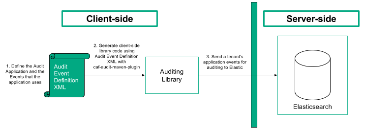

# Overview

Applications will define audit events that will occur in the system in an [Audit Event Definition File](../caf-audit-schema/README.md).
The Audit Event Definition File will be used to generate an application-specific client-side auditing library using a custom maven plugin.

For set-up:

1. Use the [Audit Service Deploy Project](https://github.com/CAFAudit/audit-service-deploy), to launch an Elasticsearch cluster.
2. Define an application's audit events in an Audit Event Definition File.
3. Generate the client-side auditing library using the audit event definition file and the code generation plugin. 
4. In your application, use the client-side auditing library to send audit events to Elasticsearch.

# Auditing Library

This project builds a library that sends audit events to Elasticsearch. Application specific auditing libraries generated with the [code generation plugin](../caf-audit-maven-plugin) use this to send  their events.

## Generating a Client-side Auditing Library

In order to use CAF Auditing you must first define the audit events in an [Audit Event Definition File](../caf-audit-schema/README.md). After you have created the definition file you can use it to generate a client-side library to make it easier to raise the defined audit events.

Technically you do not need to generate a client-side library in order to use CAF Auditing; you could use the `caf-audit` module directly, but generating a client-side library should make it easier and safer to raise events, as it should mean that each event can be raised with a single type-safe call.

Here is a sample Maven project file that generates a client-side auditing library:

	<?xml version="1.0" encoding="UTF-8"?>
	<project xmlns="http://maven.apache.org/POM/4.0.0"
         xmlns:xsi="http://www.w3.org/2001/XMLSchema-instance"
         xsi:schemaLocation="http://maven.apache.org/POM/4.0.0 http://maven.apache.org/xsd/maven-4.0.0.xsd">
	    <modelVersion>4.0.0</modelVersion>
	
	    <groupId>com.hpe.sampleapp</groupId>
	    <artifactId>sampleapp-audit</artifactId>
	    <version>1.0.0-SNAPSHOT</version>
	
	    <properties>
	        <project.build.sourceEncoding>UTF-8</project.build.sourceEncoding>
	        <maven.compiler.source>1.8</maven.compiler.source>
	        <maven.compiler.target>1.8</maven.compiler.target>
	    </properties>
	
	    <dependencies>
	        <dependency>
	            <groupId>com.github.cafaudit</groupId>
	            <artifactId>caf-audit</artifactId>
	            <version>3.0.0</version>
	        </dependency>
	    </dependencies>
	
	    <build>
	        <plugins>
	            <plugin>
	                <groupId>com.github.cafaudit</groupId>
	                <artifactId>caf-audit-maven-plugin</artifactId>
	                <version>3.0.0</version>
	                <executions>
	                    <execution>
	                        <id>generate-code</id>
	                        <phase>generate-sources</phase>
	                        <goals>
	                            <goal>xmltojava</goal>
	                        </goals>
	                    </execution>
	                </executions>
	                <configuration>
	                    <auditXMLConfig>src/main/xml/sampleapp-auditevents.xml</auditXMLConfig>
	                    <packageName>${project.groupId}.auditing</packageName>
	                </configuration>
	            </plugin>
	        </plugins>
	    </build>
	</project>

### Maven Coordinates

Like any other Maven project, the client-side auditing library must be assigned unique coordinates that can by used to reference it.

	<groupId>com.hpe.sampleapp</groupId>
	<artifactId>sampleapp-audit</artifactId>
	<version>1.0.0-SNAPSHOT</version>

### Dependencies

The generated library will have a dependency on `caf-audit`, which the generated code will use to raise the audit events. This dependency of course may introduce indirect transitive dependencies; these dependencies don't need to be directly referenced as the generated code only uses types defined in the `caf-audit` library.

	<dependencies>
	    <dependency>
	        <groupId>com.github.cafaudit</groupId>
	        <artifactId>caf-audit</artifactId>
	        <version>3.0.0</version>
	    </dependency>
	</dependencies>

### Code Generation Plugin

The `xmltojava` goal of the [code generation plugin](../caf-audit-maven-plugin) is used to generate the Java auditing code that will make up the library. The `auditXMLConfig` setting can be used to define the path to the Audit Event Definition file, and the `packageName` setting can be used to set the package in which the auditing code should be generated.

	<build>
	    <plugins>
	        <plugin>
	            <groupId>com.github.cafaudit</groupId>
	            <artifactId>caf-audit-maven-plugin</artifactId>
	            <version>3.0.0</version>
	            <executions>
	                <execution>
	                    <id>generate-code</id>
	                    <phase>generate-sources</phase>
	                    <goals>
	                        <goal>xmltojava</goal>
	                    </goals>
	                </execution>
	            </executions>
	            <configuration>
	                <auditXMLConfig>src/main/xml/sampleapp-auditevents.xml</auditXMLConfig>
	                <packageName>${project.groupId}.auditing</packageName>
	            </configuration>
	        </plugin>
	    </plugins>
	</build>

In this example the Audit Event Definition file is in the `src/main/xml/` folder, though of course it could be read from any folder. The name of the package to use is being built up by appending `.auditing` to the project's group identifier (i.e. `com.hpe.sampleapp` in this example).

### String Validation

The standard auditing library, `caf-audit`, performs string validation on audit events through the `AuditValidator` object. This applies only to string data where the audit event parameter has been configured with minimum and/or maximum length constraints in the [Audit Event Definition File](../caf-audit-schema/README.md). Where a `MinLength` constraint has been defined, validation will fail if the length of the given string is less than this number. Where a `MaxLength` constraint has been defined, validation will fail if the length of the given string is greater than this number.

## Using a Client-side Auditing Library

### Dependencies

A generated client-side library should be referenced in the normal way in the application's POM file. You shouldn't need to manually add a dependency on `caf-audit` as it will be a transitive dependency of the generated library.

	<dependency>
	    <groupId>com.hpe.sampleapp</groupId>
	    <artifactId>sampleapp-audit</artifactId>
	    <version>1.0.0-SNAPSHOT</version>
	</dependency>

### Audit Connection

Regardless of whether you choose to use a generated client-side library, or to use `caf-audit` directly, you must first create an `AuditConnection` object.

This object represents a logical connection to the datastore (that is, Elasticsearch in the current implementation). It is a thread-safe object. ***Please take into account that this object requires some time to construct. The application should hold on to it and re-use it, rather than constantly re-construct it.***

The `AuditConnection` object can be constructed using the static `createConnection()` method in the `AuditConnectionFactory` class. This method takes a `ConfigurationSource` parameter, which is the standard method of configuration in CAF.

### Configuration in CAF

You may already have a CAF Configuration Source in your application. It is a general framework that abstracts away the source of the configuration, allowing it to come from environment variables, files, a REST service, or potentially a custom source which better integrates with the host application.
If you're not already using CAF's Configuration mechanism, then here is some sample code to generate a ConfigurationSource object.

	import com.hpe.caf.api.*;
	import com.hpe.caf.cipher.NullCipherProvider;
	import com.hpe.caf.config.system.SystemBootstrapConfiguration;
	import com.hpe.caf.naming.ServicePath;
	import com.hpe.caf.util.ModuleLoader;
	
	public static ConfigurationSource createCafConfigSource() throws Exception
	{
	    System.setProperty("CAF_CONFIG_PATH", "/etc/sampleapp/config");
	    System.setProperty("CAF_APPNAME", "sampleappgroup/sampleapp");
	
	    BootstrapConfiguration bootstrap = new SystemBootstrapConfiguration();
	    Cipher cipher = ModuleLoader.getService(CipherProvider.class, NullCipherProvider.class).getCipher(bootstrap);
	    ServicePath path = bootstrap.getServicePath();
	    Codec codec = ModuleLoader.getService(Codec.class);
	    return ModuleLoader.getService(ConfigurationSourceProvider.class).getConfigurationSource(bootstrap, cipher, path, codec);
	}

To compile the above sample code you will need to add the following dependencies to your POM:

	<dependency>
	    <groupId>com.github.cafapi</groupId>
	    <artifactId>caf-api</artifactId>
	    <version>1.6.0-176</version>
	</dependency>
	<dependency>
	    <groupId>com.github.cafapi.cipher</groupId>
	    <artifactId>cipher-null</artifactId>
	    <version>1.6.0-176</version>
	</dependency>
	<dependency>
	    <groupId>com.github.cafapi.config</groupId>
	    <artifactId>config-system</artifactId>
	    <version>1.6.0-176</version>
	</dependency>
	<dependency>
	    <groupId>com.github.cafapi.util</groupId>
	    <artifactId>util-moduleloader</artifactId>
	    <version>1.6.0-176</version>
	</dependency>
	<dependency>
	    <groupId>com.github.cafapi.util</groupId>
	    <artifactId>util-naming</artifactId>
	    <version>1.6.0-176</version>
	</dependency>

To use JSON-encoded files for your configuration you will need to add the following additional dependencies to your POM:

	<!-- Runtime-only Dependencies -->
	<dependency>
	    <groupId>com.github.cafapi.config</groupId>
	    <artifactId>config-file</artifactId>
	    <version>1.6.0-176</version>
	    <scope>runtime</scope>
	</dependency>
	<dependency>
	    <groupId>com.github.cafapi.codec</groupId>
	    <artifactId>codec-json</artifactId>
	    <version>1.6.0-176</version>
	    <scope>runtime</scope>
	</dependency>
	<dependency>
	    <groupId>io.dropwizard</groupId>
	    <artifactId>dropwizard-core</artifactId>
	    <version>0.8.4</version>
	    <scope>runtime</scope>
	</dependency>

### Configuration Required to create the AuditConnection

In the `ConfigurationSource` above, we used JSON-encoded files with the following parameters:

- `CAF_CONFIG_PATH: /etc/sampleapp/config`
- `CAF_APPNAME: sampleappgroup/sampleapp`

Given this configuration, you would configure Auditing by creating a file named `cfg_sampleappgroup_sampleapp_ElasticAuditConfiguration` in the `/etc/sampleapp/config/` directory. The contents of this file should be similar to the following:

	{
	    "hostAndPortValues": "<Elasticsearch_Cluster_Node1>:<ES_Port_Node1>,<Elasticsearch_Cluster_Node2>:<ES_Port_Node2>,<Elasticsearch_Cluster_Node3>:<ES_Port_Node3>",
	    "clusterName": "elasticsearch-cluster",
	    "numberOfShards": "5",
	    "numberOfReplicas": "1"
	}

where:

- `hostAndPortValues` refers to one or more of the nodes of the Elasticsearch cluster as a comma-separated list.
- `clusterName` name of the Elasticsearch cluster. Defaults to "elasticsearch-cluster".
- `numberOfShards` the number of primary shards that an index should have. Defaults to 5.
- `numberOfReplicas` the number of replica shards (copies) that each primary shard should have. Defaults to 1.

### Audit Channel

After you successfully construct an `AuditConnection` object, you must then create an `AuditChannel` object.

This object represents a logical channel to the datastore (that is, Elasticsearch in this implementation). **It is NOT a thread-safe object and must not be shared across threads without synchronization.** However, you will have no issue constructing multiple `AuditChannel` objects simultaneously on different threads. The objects are lightweight and caching them is not that important.

The `AuditChannel` object can be constructed using the `createChannel()` method on the `AuditConnection` object. It does not take any parameters.

### Audit Log

The generated library contains an `AuditLog` class, which contains static methods used to log audit events.

Import the `AuditLog` class belonging to the package name of the project that generated it for your application.

The following is an example for a SampleApp's `viewDocument` event, which takes a single document identifier parameter:

	/**
	 * Audit the viewDocument event
	 * @param channel Identifies the channel to be used for message queuing 
	 * @param tenantId Identifies the tenant that the user belongs to 
	 * @param userId Identifies the user who triggered the event 
	 * @param correlationId Identifies the same user action 
	 * @param docId Document Identifier 
	 */
	public static void auditViewDocument
	(
	    final AuditChannel channel,
	    final String tenantId,
	    final String userId,
	    final String correlationId,
	    final long docId
	)
	    throws Exception
	{
	    final AuditEventBuilder auditEventBuilder = channel.createEventBuilder();
	    auditEventBuilder.setApplication(APPLICATION_IDENTIFIER);
	    auditEventBuilder.setTenant(tenantId);
	    auditEventBuilder.setUser(userId);
	    auditEventBuilder.setCorrelationId(correlationId);
	    auditEventBuilder.setEventType("documentEvents", "viewDocument");
	    auditEventBuilder.addEventParameter("docId", null, docId);
	
	    auditEventBuilder.send();
	}

The name of the event is included in the generated method name. In addition to the custom parameters (document id in this case), the caller must pass the `AuditChannel` object to be used, as well as the tenant id, user id, and correlation id.

The method will throw an exception if the audit event could not be stored for some reason (for example, network failure or supplying unsupported tenantId characters).
