# Getting Started

You need to perform the following steps to set up the Audit Management service.

1. Install and configure HPE Vertica 7.2.x on a dedicated machine.
2. Install and configure Apache Kafka on a dedicated machine.
3. Using the Chateau deployment toolset, launch the Apache Kafka-Vertica scheduler and the Audit Management web service in Mesos/Marathon.
4. Define an application's audit events in an Audit Event Definition File.
5. Register the audit event definition file and add tenant(s) with the Audit Management web service. This creates the necessary database tables in Vertica.
6. Generate the client-side auditing library using the audit event definition file and the code generation plugin. 
7. In your application, use the client-side auditing library to send audit events to Kafka. The Audit Scheduler will automatically load the events from Kafka into HPE Vertica.

These steps are explained in more detail in  subsequent sections:

- [Deploying HPE Vertica](deploying-hpe-vertica)
- [Deploying Kafka](#deploying-kafka)
- [Deploying Audit Web Service and Kafka-Vertica Scheduler](#deploying-audit-web-service-and-kafka-vertica-scheduler)
- [Writing an Application Audit Event Definition File](#writing-an-application-audit-event-definition-file)
- [Using the Audit Management Web Service](#using-the-audit-management-web-service)
- [Generating a Client-side Auditing Library](#generating-a-client-side-auditing-library)
- [Using the Client-side Auditing Library](#using-the-client-side-auditing-library)

For more information on Chateau, go [here](https://github.hpe.com/caf/chateau).

For more information on Vertica, go [here](https://my.vertica.com/).

For more information on Apache Kafka, go [here](http://kafka.apache.org/).

## Deploying HPE Vertica

HPE Vertica is a SQL database designed for delivering speed, scalability and support for analytics. In the Auditing service, Vertica ultimately stores the audit events on a per-application, per-tenant basis. You can then use analysis tools on the data to gather metrics about the audited applications.

### HPE Vertica Development Deployment

For development deployments of HPE Vertica, we recommend that you use [vagrant-vertica](https://github.hpe.com/caf/vagrant-vertica) and follow its supporting documentation to start a guest VM running HPE Vertica with Vagrant. As part of this deployment, the provisioning scripts create the service user, loader user, reader user, and reader role.

Vagrant-vertica is not recommended for production deployments. Please make note of the following caveats:

- Vertica DB usernames and passwords, used during automated installation, are held as plain text within the VM's provisioning scripts.
- Vagrant-vertica is a standalone, single-node setup only; provisioning scripts do not support clustered configurations.

### HPE Enterprise Deployment

For an enterprise deployments of HPE Vertica, please follow the official HPE Vertica documentation as it covers cluster setup, configuration and backup. Integration of HPE Vertica with your Kafka broker cluster is also covered: [Official HPE Vertica Documentation](https://my.vertica.com/documentation/vertica/7-2-x/)

#### Database, Role & Service Accounts

Once you install HPE Vertica, you need to create a database, service accounts and a reader role. You need all of these for Audit Management to work correctly.

The sections that follow provide example commands for creating the database, users, and roles.

##### Create Database

To create a database in HPE Vertica:

1. Log onto the Vertica machine as the dbadmin user.

2. If you do not have an existing, shared HPE Vertica database, you can create a new database with the admintools command utility:

	```/opt/vertica/bin/admintools -t create_db -d "CAFAudit" -p "CAFAudit" -s 127.0.0.1```

##### Create CAF Audit Read-Only User Role

A read-only role is required for users of search and anayltics services that wish to query the audit data in Vertica.

1. Enter a CREATE ROLE command to create an audit reader role:
	`CREATE ROLE "caf-audit-read";`

	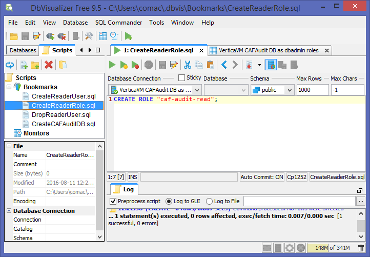

  **Note:** For illustrative purposes, the following example shows the creation of a new user and then grants that new user the audit reader role. In practice, it is more likely you would grant the reader role to an existing user, who wishes to query data in HPE Vertica for search and analytics purposes. 
  
2. Create a new user and assign a password with IDENTIFIED BY:
	`CREATE USER "caf-audit-reader" IDENTIFIED BY 'c@FaR3aD3R';`

	


3. Grant the user the audit reader role:
	`GRANT "caf-audit-read" TO "caf-audit-reader";`

	

4. Enable the user with the audit reader role:
	`ALTER USER "caf-audit-reader" DEFAULT ROLE "caf-audit-read";`

	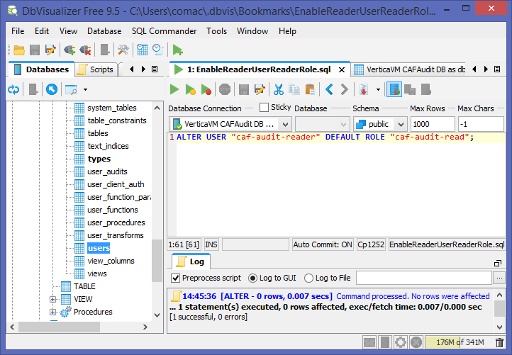

The `caf-audit-read` role is granted its privileges internally by the Audit Management Web Service during tenant registration. When a new tenant is added, the database schema and corresponding tables for that tenant are created. It is during this stage that the `caf-audit-read` role is granted USAGE on the schema and SELECT on the relevant table.

##### Create CAF Audit Service User

The Audit Management web service requires a service account to create database tables for registered applications and their tenants.

1. Create the Audit Service user and assign them a password with IDENTIFIED BY:
	`CREATE USER "caf-audit-service" IDENTIFIED BY 'c@Fa5eR51cE';`

	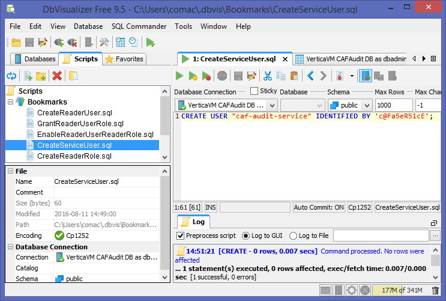

2. Grant the Audit Service user database CREATE permission:
	`GRANT CREATE ON DATABASE "CAFAudit" TO "caf-audit-service";`

	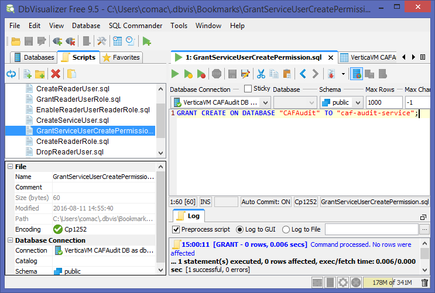

##### Create Audit Loader User

The Kafka-Vertica Scheduler requires a loader account for loading audit events from Kafka into HPE Vertica.

1. To create the CAF Audit Loader User and assign them a password with IDENTIFIED BY:
	`CREATE USER "caf-audit-loader" IDENTIFIED BY 'c@FaL0Ad3r';`

	

2. Grant the Audit Loader user pseudo super user role:
	`GRANT PSEUDOSUPERUSER TO "caf-audit-loader";`

	

3. Enable the Audit Loader user with the pseudo super user role:
	`ALTER USER "caf-audit-loader" DEFAULT ROLE PSEUDOSUPERUSER;`

	

#### Prepare Vertica with Kafka-Vertica Scheduler Schema

You should use the vkconfig script, which comes pre-packaged and installed with the HPE Vertica rpm, with the *scheduler* sub-utility and *--add* option to add a schema for the Kafka-Vertica Scheduler to keep track of application tenant topics. You need to run the command as the root or dbadmin user:

	/opt/vertica/packages/kafka/bin/vkconfig scheduler --add 
		--config-schema auditscheduler 
		--brokers [BROKERS] 
		--username [USERNAME] 
		--password [PASSWORD] 
		--operator [OPERATOR]
	
where:

* [BROKERS] - Specifies the kafka broker(s) to be used, it is formatted as a comma separated list of address:port endpoints.
* [USERNAME] - Is the Vertica database loader account name (e.g. caf-audit-loader).
* [PASSWORD] - Is the password for the Vertica database loader account name. (e.g. "c@FaL0Ad3r")
* [OPERATOR] - Is the Vertica database loader account name wrapped in double quotes(e.g. "\"caf-audit-loader\"").

**Example:**

	/opt/vertica/packages/kafka/bin/vkconfig scheduler --add --config-schema auditscheduler --brokers 192.168.56.20:9092 --username caf-audit-loader --password "c@FaL0Ad3r" --operator "\"caf-audit-loader\""

##### Verification

The following figure shows the CAFAudit database with a new schema for tracking application tenant topics after running the `vkconfig scheduler --add` command:

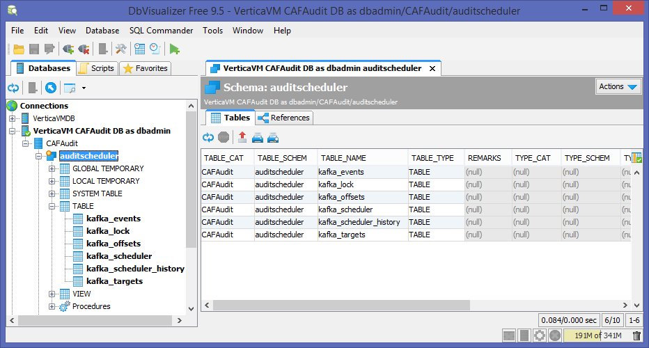

## Deploying Kafka

Apache Kafka is a distributed, partitioned, replicated commit log service that provides messaging system functionality for producers and consumers of messages. Kafka's role in the Audit Management service is to receive tenant events from client-side applications (producers) as messages. On the server-side, the Kafka-Vertica Scheduler (consumer) reads event messages from per application, per tenant Kafka topics and streams the events into HPE Vertica.

### Apache Kafka Development Deployment

We recommend that you use [vagrant-kafka](https://github.hpe.com/caf/vagrant-kafka) and follow its supporting documentation to start a guest VM running Kafka with Vagrant.

Vagrant-kafka is not recommended for production deployments. It's a standalone single node setup only; provisioning scripts do not support multiple machine clustered configurations.

### Apache Kafka Enterprise Deployment

For enterprise deployments of Kafka, we recommend that you follow the official Apache Kafka documentation as it covers clustered deployments and topic partitioning: [Apache Kafka Documentation](http://kafka.apache.org/documentation.html)

Integration of HPE Vertica with your Kafka broker cluster is covered in the [Official HPE Vertica Documentation](https://my.vertica.com/documentation/vertica/7-2-x/)

## Deploying Audit Web Service and Kafka-Vertica Scheduler

### Audit Management Web Service

The Audit Management web service offers a REST API for audit users to register and prepare HPE Vertica and the Kafka-Vertica Scheduler with their applications and tenants using those applications.

### Kafka-Vertica Scheduler

The Kafka-Vertica Scheduler is responsible for consuming audit event messages, from per application per tenant Kafka topics, and streaming them into the appropriate HPE Vertica database tables.

### Deployment with Chateau

**[Chateau](https://github.hpe.com/caf/chateau)** can launch CAF workers and services such as the Audit Management web service and the Kafka-Vertica Scheduler.

- To download and set up Chateau, follow the instructions in the [README.md](https://github.hpe.com/caf/chateau/blob/develop/README.md).

- For enterprise deployments of HPE Vertica, add the details of your host and user accounts to Chateau's environment/vertica.json file.

- For enterprise deployments of Kafka, add the details of your Kafka brokers to Chateau's environment/kafka.json file.

- To deploy the Audit Management web service and the Kafka-Vertica Scheduler, follow the [Service Deployment](https://github.hpe.com/caf/chateau/blob/develop/deployment.md) guide and use the following option with the deployment shell script: `./deploy-service.sh audit`

The following figure shows a Marathon environment running the Audit services started with Chateau:


## Writing an Application Audit Event Definition File

An application for auditing requires the construction of an audit event definition XML file that defines the name of the application and its events. With the use of the caf-audit-maven-plugin, the application's definition file is used to generate a client-side library that the audited application calls to log tenant events. The definition file is then also used to register the application and its events for auditing with the server-side Audit Management web service.

The following figure illustrates the audit event definition XML file's schema.

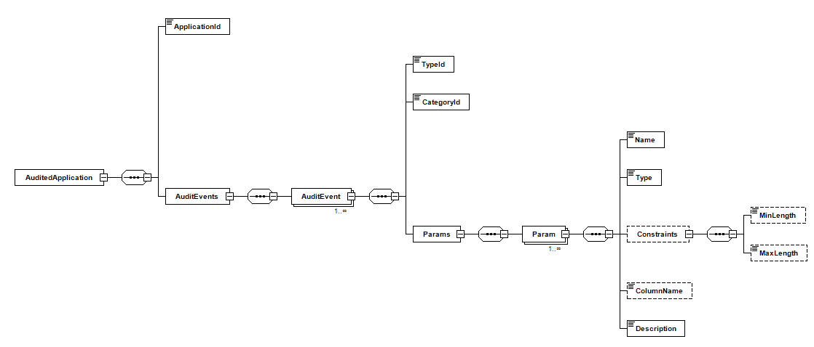

where:

`AuditedApplication` is the root element.

`ApplicationId` identifies the application with which the audit events are associated.

For each audit event, `TypeId` is a string identifier for the particular event (for example, viewDocument) and `CategoryId` is a string identifier for the category of the event.

A list of parameter elements are then defined for each audit event, including the following:
- `Name`
- `Type` (string, short, int, long, float, double, boolean or date)
- `Description`
- `ColumnName` (optional) can be used to force the use of a particular database column to store the audit data. 
- `Constraints` (optional) can be used to specify minimum and/or maximum length constraints for audit event parameters of `Type` string.

### Using the Schema File

If you reference the XML schema file from your audit event definition file, then you should be able to use the validate functionality that is built into most IDEs and XML editors. Validate allows you to easily check for syntax errors in your audit event definition file. Just add the standard `xsi:schemaLocation` attribute to the root `AuditedApplication` element:

	<AuditedApplication xmlns="http://www.hpe.com/CAF/Auditing/Schema/AuditedApplication.xsd"
	                    xmlns:xsi="http://www.w3.org/2001/XMLSchema-instance"
	                    xsi:schemaLocation="http://www.hpe.com/CAF/Auditing/Schema/AuditedApplication.xsd http://rh7-artifactory.svs.hpeswlab.net:8081/artifactory/policyengine-release/com/hpe/caf/caf-audit-schema/1.1/caf-audit-schema-1.1.jar!/schema/AuditedApplication.xsd">

Many IDEs and XML editors use the schema file to provide IntelliSense and type-ahead when authoring the definition file.

### Example Audit Event Definition XML

The following is an example of an audit event definition file used throughout this guide:

	<?xml version="1.0" encoding="UTF-8"?>
	<AuditedApplication xmlns="http://www.hpe.com/CAF/Auditing/Schema/AuditedApplication.xsd"
	                    xmlns:xsi="http://www.w3.org/2001/XMLSchema-instance"
	                    xsi:schemaLocation="http://www.hpe.com/CAF/Auditing/Schema/AuditedApplication.xsd http://rh7-artifactory.svs.hpeswlab.net:8081/artifactory/policyengine-release/com/hpe/caf/caf-audit-schema/1.1/caf-audit-schema-1.1.jar!/schema/AuditedApplication.xsd">
	  <ApplicationId>SampleApp</ApplicationId>
	  <AuditEvents>
	    <AuditEvent>
	      <TypeId>viewDocument</TypeId>
	      <CategoryId>documentEvents</CategoryId>
	      <Params>
	        <Param>
	          <Name>docId</Name>
	          <Type>long</Type>
	          <Description>Document Identifier</Description>
	        </Param>
	      </Params>
	    </AuditEvent>
	    <AuditEvent>
	      <TypeId>deleteDocument</TypeId>
	      <CategoryId>documentEvents</CategoryId>
	      <Params>
	        <Param>
	          <Name>docId</Name>
	          <Type>long</Type>
	          <Description>Document Identifier</Description>
	        </Param>
	        <Param>
	          <Name>authorisedBy</Name>
	          <Type>string</Type>
			  <Constraints>
				<MinLength>1</MinLength>
				<MaxLength>256</MaxLength>
			  </Constraints>
	          <Description>User who authorised the deletion</Description>
	        </Param>
	      </Params>
	    </AuditEvent>
	  </AuditEvents>
	</AuditedApplication>

## Using the Audit Management Web Service

To start using the web service, you exercise the endpoints by accessing the Swagger web user interface at the following URL:

	http://<audit.web.service.host.address>:<port>/caf-audit-management-ui

Replace `<audit.web.service.host.address>` and `<port>` as necessary.

### Loading the XML Audit Events File

Application audit events are defined within the audit event definition file, which is used to register the application on the server side. The following figure shows the /applications endpoint for loading this file:

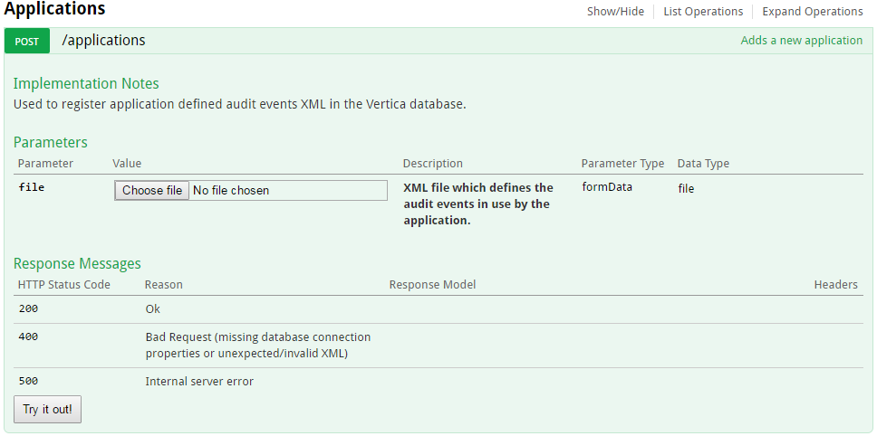

#### Verification Instructions

When an application events file is registered, it configures the HPE Vertica database with audit management tables to record both the application-specific audit events XML as well as tenants added through the service. See the `ApplicationEvents` and `TenantApplications` tables under the `AuditManagement` schema in the HPE Vertica database. An entry in the `ApplicationEvents` table will also be created to register the application events XML supplied. The following figure shows the `ApplicationEvents` table containing an entry for the SampleApp audit event definition file:

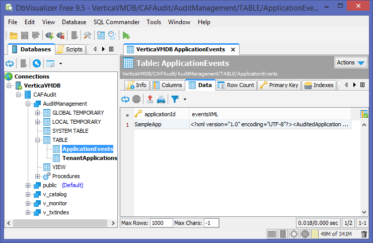

Further calls to load new application audit event definition files result in additional rows being added to the `ApplicationEvents` table.

### Adding Tenants

Once applications have been registered, tenants can then be added using the /tenants endpoint. You need to supply the tenant and application identifiers in the call to this endpoint. You can associate a tenant with more than one application by passing multiple application identifiers as a JSON array of strings.

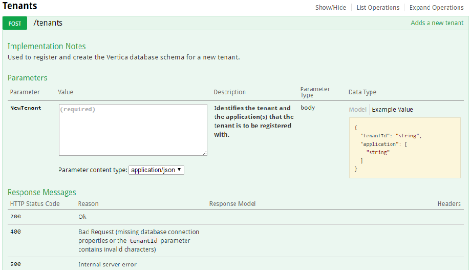

#### Verification Instructions

Every time you add a new tenant, a new row is inserted into the `TenantApplications` table under the `AuditManagement` schema. The following figure illustrates this:

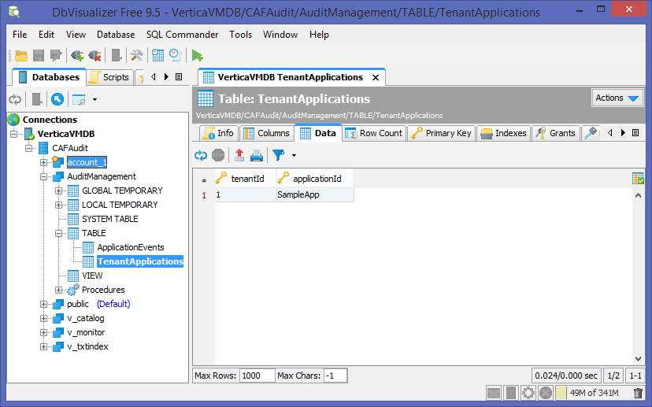

A new tenant-specific database schema is then created for the tenant in the HPE Vertica database, which is comprised of a number of tables. See [Auditing Database Tables](https://github.hpe.com/caf/caf-audit-management-service-container/blob/develop/documentation/auditing-database-tables.md). If the client-side auditing library sent audit events for this tenant through to the Kafka messaging service, this audit event data should start to arrive in the application-specific audit events table under the tenant-specific schema created as part of the add tenant web service call.

The following figure shows an `account_1` schema with an `AuditSampleApp` table and the columns for audit event data for the application:

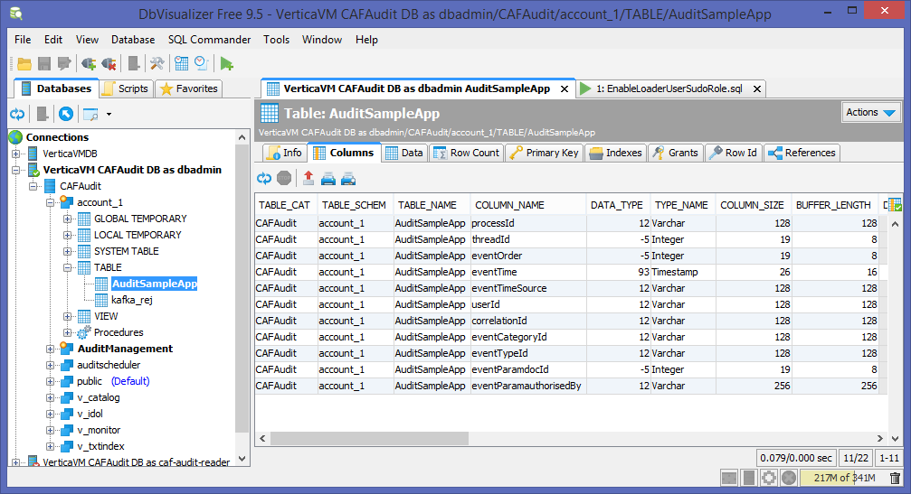

In the case of malformed audit events being passed to auditing, there is a reject table for holding these. The following figure shows the `account_1` schema with a `kafka_rej` table and columns for rejected audit event data:

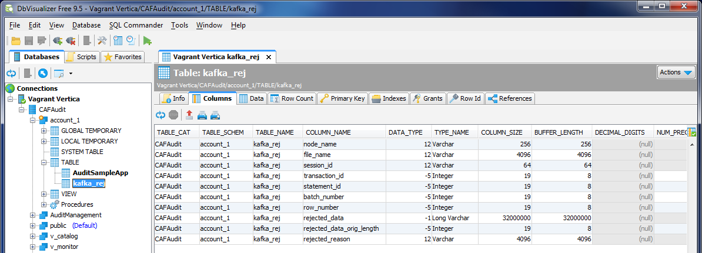

## Generating a Client-side Auditing Library

As previously mentioned, in order to use Auditing, you must first define the audit events in an audit event definition file. After you create the definition file, you use it to generate a client-side library. Technically, you do not need to generate a client-side library to use Auditing; you could use the `caf-audit` module directly. However, generating a client-side library should make it easier and safer to raise events because each event can be raised with a single type-safe call.

The following sample Maven project file generates a client-side auditing library:

	<?xml version="1.0" encoding="UTF-8"?>
	<project xmlns="http://maven.apache.org/POM/4.0.0"
         xmlns:xsi="http://www.w3.org/2001/XMLSchema-instance"
         xsi:schemaLocation="http://maven.apache.org/POM/4.0.0 http://maven.apache.org/xsd/maven-4.0.0.xsd">
	    <modelVersion>4.0.0</modelVersion>
	
	    <groupId>com.hpe.sampleapp</groupId>
	    <artifactId>sampleapp-audit</artifactId>
	    <version>1.0-SNAPSHOT</version>
	
	    <properties>
	        <project.build.sourceEncoding>UTF-8</project.build.sourceEncoding>
	        <maven.compiler.source>1.8</maven.compiler.source>
	        <maven.compiler.target>1.8</maven.compiler.target>
	    </properties>
	
	    <dependencies>
	        <dependency>
	            <groupId>com.hpe.caf</groupId>
	            <artifactId>caf-audit</artifactId>
	            <version>1.2</version>
	        </dependency>
	    </dependencies>
	
	    <build>
	        <plugins>
	            <plugin>
	                <groupId>com.hpe.caf</groupId>
	                <artifactId>caf-audit-maven-plugin</artifactId>
	                <version>1.1</version>
	                <executions>
	                    <execution>
	                        <id>generate-code</id>
	                        <phase>generate-sources</phase>
	                        <goals>
	                            <goal>xmltojava</goal>
	                        </goals>
	                    </execution>
	                </executions>
	                <configuration>
	                    <auditXMLConfig>src/main/xml/sampleapp-auditevents.xml</auditXMLConfig>
	                    <packageName>${project.groupId}.auditing</packageName>
	                </configuration>
	            </plugin>
	        </plugins>
	    </build>
	
	    <pluginRepositories>
	        <pluginRepository>
	            <id>cmbg-maven-releases</id>
	            <name>Cambridge Nexus Releases</name>
	            <url>http://cbgmaven.hpeswlab.net/nexus/content/repositories/releases</url>
	            <snapshots>
	                <enabled>false</enabled>
	            </snapshots>
	        </pluginRepository>
	    </pluginRepositories>
	</project>

### Maven Coordinates

Like any other Maven project, the client-side auditing library must be assigned a unique groupId, artifactId, and version, which are used to reference it.

	<groupId>com.hpe.sampleapp</groupId>
	<artifactId>sampleapp-audit</artifactId>
	<version>1.0-SNAPSHOT</version>

### Dependencies

The generated library has a dependency on `caf-audit`, which the generated code uses to raise the audit events. This dependency, of course, may introduce indirect, transitive dependencies; these dependencies don't need to be directly referenced as the generated code only uses types defined in the `caf-audit` library.

	<dependencies>
	    <dependency>
	        <groupId>com.hpe.caf</groupId>
	        <artifactId>caf-audit</artifactId>
	        <version>1.2</version>
	    </dependency>
	</dependencies>

### Code Generation Plugin

The `xmltojava` goal of the code generation plugin is used to generate the Java auditing code that makes up the library. The `auditXMLConfig` setting defines the path to the audit event definition file, and the `packageName` setting sets the package in which the auditing code should be generated.

	<build>
	    <plugins>
	        <plugin>
	            <groupId>com.hpe.caf</groupId>
	            <artifactId>caf-audit-maven-plugin</artifactId>
	            <version>1.1</version>
	            <executions>
	                <execution>
	                    <id>generate-code</id>
	                    <phase>generate-sources</phase>
	                    <goals>
	                        <goal>xmltojava</goal>
	                    </goals>
	                </execution>
	            </executions>
	            <configuration>
	                <auditXMLConfig>src/main/xml/sampleapp-auditevents.xml</auditXMLConfig>
	                <packageName>${project.groupId}.auditing</packageName>
	            </configuration>
	        </plugin>
	    </plugins>
	</build>

In this example, the audit event definition file is in the `src/main/xml/` folder, though, it could be read from any folder. The name of the package to use is built up by appending ".auditing" to the project's group identifier (that is, "com.hpe.sampleapp" in this example).

### Plugin Repositories

Depending on how your Maven settings.xml file is configured, the `pluginRepositories` section may or may not be required to locate the code generation plugin.

	<pluginRepositories>
	    <pluginRepository>
	        <id>cmbg-maven-releases</id>
	        <name>Cambridge Nexus Releases</name>
	        <url>http://cbgmaven.hpeswlab.net/nexus/content/repositories/releases</url>
	        <snapshots>
	            <enabled>false</enabled>
	        </snapshots>
	    </pluginRepository>
	</pluginRepositories>

In this example, the URL is set to [http://cbgmaven.hpeswlab.net/nexus/content/repositories/releases](http://cbgmaven.hpeswlab.net/nexus/content/repositories/releases), but, if that location is inaccessible, you could try one of the following URLs instead:

- [http://rh7-artifactory.svs.hpeswlab.net:8081/artifactory/policyengine-release](http://rh7-artifactory.svs.hpeswlab.net:8081/artifactory/policyengine-release)
- [http://16.26.25.50/nexus/content/repositories/releases](http://16.26.25.50/nexus/content/repositories/releases)
- [http://16.103.3.109:8081/artifactory/policyengine-release](http://16.103.3.109:8081/artifactory/policyengine-release)

### No-op Auditing Library

A dummy implementation of the standard auditing library, `caf-audit`, is provided to support developers without any Apache Kafka infrastructure. It has the same interface as the standard auditing library but does not send anything to Kafka. This library allows you to continue to work with your application without installing and configuring Apache Kafka.

In order to make use of this no-op auditing library, simply modify the Maven Coordinates for the `caf-audit` dependency and specify `1.2-NOOP` as the version rather than just `1.2`:

	<dependencies>
	    <dependency>
	        <groupId>com.hpe.caf</groupId>
	        <artifactId>caf-audit</artifactId>
	        <version>1.2-NOOP</version>
	    </dependency>
	</dependencies>

Alternatively, you could do something custom at runtime, where you replace the standard auditing library jar with the no-op version.

## Using the Client-side Auditing Library

Once you have your auditing library (generated or `caf-audit`), you use it to send audit events to Kafka.

### Dependencies

A generated client-side library should be referenced in the normal way in the application's POM file. You shouldn't need to manually add a dependency on `caf-audit` as it will be a transitive dependency of the generated library.

	<dependency>
	    <groupId>com.hpe.sampleapp</groupId>
	    <artifactId>sampleapp-audit</artifactId>
	    <version>1.0-SNAPSHOT</version>
	</dependency>

### Audit Connection

Regardless of whether you choose to use a generated client-side library, or to use `caf-audit` directly, you must first create an `AuditConnection` object.

This object represents a logical connection to persistent storage (that is, Kafka in the current implementation). It is a thread-safe object. ***Please take into account that this object requires some time to construct. The application should hold on to it and re-use it, rather than constantly re-construct it.***

The `AuditConnection` object can be constructed using the static `createConnection()` method in the `AuditConnectionFactory` class. This method takes a `ConfigurationSource` parameter, which is the standard method of configuration in CAF.

#### ConfigurationSource

[comment]: <> (The caf-audit Client-API.md documentation content contains duplication of the ConfigurationSource section. It is important that any changes here must also be included within the Client-API.md content.)

You may already have a CAF configuration source in your application. It is a general framework that abstracts the source of the configuration, allowing it to come from any of the following:

* environment variables
* files
* a REST service
* a custom source that better integrates with the host application.

If you're not already using CAF's configuration mechanism, this sample code illustrates the generation of a ConfigurationSource object.

	import com.hpe.caf.api.*;
	import com.hpe.caf.cipher.NullCipherProvider;
	import com.hpe.caf.config.system.SystemBootstrapConfiguration;
	import com.hpe.caf.naming.ServicePath;
	import com.hpe.caf.util.ModuleLoader;
	
	public static ConfigurationSource createCafConfigSource() throws Exception
	{
	    System.setProperty("CAF_CONFIG_PATH", "/etc/sampleapp/config");
	    System.setProperty("CAF_APPNAME", "sampleappgroup/sampleapp");
	
	    BootstrapConfiguration bootstrap = new SystemBootstrapConfiguration();
	    Cipher cipher = ModuleLoader.getService(CipherProvider.class, NullCipherProvider.class).getCipher(bootstrap);
	    ServicePath path = bootstrap.getServicePath();
	    Codec codec = ModuleLoader.getService(Codec.class);
	    return ModuleLoader.getService(ConfigurationSourceProvider.class).getConfigurationSource(bootstrap, cipher, path, codec);
	}

To compile the above sample code, add the following dependencies to your POM:

	<dependency>
	    <groupId>com.hpe.caf</groupId>
	    <artifactId>caf-api</artifactId>
	    <version>11.2</version>
	</dependency>
	<dependency>
	    <groupId>com.hpe.caf.cipher</groupId>
	    <artifactId>cipher-null</artifactId>
	    <version>10.0</version>
	</dependency>
	<dependency>
	    <groupId>com.hpe.caf.config</groupId>
	    <artifactId>config-system</artifactId>
	    <version>10.0</version>
	</dependency>
	<dependency>
	    <groupId>com.hpe.caf.util</groupId>
	    <artifactId>util-moduleloader</artifactId>
	    <version>1.1</version>
	</dependency>
	<dependency>
	    <groupId>com.hpe.caf.util</groupId>
	    <artifactId>util-naming</artifactId>
	    <version>1.0</version>
	</dependency>

To use JSON-encoded files for your configuration, add the following additional dependencies to your POM:

	<!-- Runtime-only Dependencies -->
	<dependency>
	    <groupId>com.hpe.caf.config</groupId>
	    <artifactId>config-file</artifactId>
	    <version>10.0</version>
	    <scope>runtime</scope>
	</dependency>
	<dependency>
	    <groupId>com.hpe.caf.codec</groupId>
	    <artifactId>codec-json</artifactId>
	    <version>10.1</version>
	    <scope>runtime</scope>
	</dependency>
	<dependency>
	    <groupId>io.dropwizard</groupId>
	    <artifactId>dropwizard-core</artifactId>
	    <version>0.8.4</version>
	    <scope>runtime</scope>
	</dependency>

#### Configuration Required for the AuditConnection

In the `ConfigurationSource` above, we used JSON-encoded files with the following parameters:

- `CAF_CONFIG_PATH: /etc/sampleapp/config`
- `CAF_APPNAME: sampleappgroup/sampleapp`

Given this configuration, you would configure Auditing by creating a file named `cfg_sampleappgroup_sampleapp_KafkaAuditConfiguration` in the `/etc/sampleapp/config/` directory. The contents of this file should be similar to the following:

	{
	    "bootstrapServers": "192.168.56.20:9092",
	    "acks": "all",
	    "retries": "0"
	}

where:

- `bootstrapServers` refers to one or more of the nodes of the Kafka cluster as a comma-separated list.
- `acks` is the number of nodes in the cluster which must acknowledge an audit event when it is sent.

### Audit Channel

After you successfully construct an `AuditConnection` object, you must construct an `AuditChannel` object.

This object represents a logical channel to the persistent storage (that is, Kafka in this implementation). **It is NOT a thread-safe object and must not be shared across threads without synchronization.** However, you will have no issue constructing multiple `AuditChannel` objects simultaneously on different threads. The objects are lightweight and caching them is not that important.

The `AuditChannel` object can be constructed using the `createChannel()` method on the `AuditConnectionn` object. It does not take any parameters.

### Audit Log

The generated library contains an `AuditLog` class, which contains static methods used to log audit events.

Following is an example for a SampleApp's `viewDocument` event, which takes a single document identifier parameter:

	/**
	 * Audit the viewDocument event
	 * @param channel Identifies the channel to be used for message queuing 
	 * @param tenantId Identifies the tenant that the user belongs to 
	 * @param userId Identifies the user who triggered the event 
	 * @param correlationId Identifies the same user action 
	 * @param docId Document Identifier 
	 */
	public static void auditViewDocument
	(
	    final AuditChannel channel,
	    final String tenantId,
	    final String userId,
	    final String correlationId,
	    final long docId
	)
	    throws Exception
	{
	    final AuditEventBuilder auditEventBuilder = channel.createEventBuilder();
	    auditEventBuilder.setApplication(APPLICATION_IDENTIFIER);
	    auditEventBuilder.setTenant(tenantId);
	    auditEventBuilder.setUser(userId);
	    auditEventBuilder.setCorrelationId(correlationId);
	    auditEventBuilder.setEventType("documentEvents", "viewDocument");
	    auditEventBuilder.addEventParameter("docId", null, docId);
	
	    auditEventBuilder.send();
	}

The name of the event is included in the generated method name. In addition to the custom parameters (document id in this case), the caller must pass the `AuditChannel` object to be used, as well as the tenant id, user id, and correlation id.

The method will throw an exception if the audit event could not be stored for some reason (for example, network failure).

### Verification Instructions

Every time an `AuditLog` method is called, a new row is entered into the tenant's audit application table. The following figure shows a tenant's `account_1` schema's `AuditSampleApp` table with an audit event entry with data for an audit event:


---
