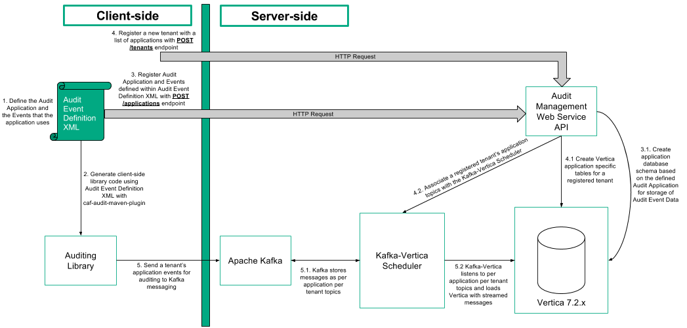

# Architecture

Audit Management is a service for logging application events on a per tenant basis.

An application and its events are defined in an Audit Event Definition File that is used to generate an application-specific client-side auditing library. The generated client-side Java library is used to send audit event messages to the Apache Kafka messaging service.

On the server-side, with the use of the Audit Management Web Service API, the application's Audit Event Definition File is used to create an application's audit event schema within Vertica. The Web API is then used to register a tenant with one or more applications. It creates application audit event tables for the tenant and configures the Kafka-Vertica Scheduler to load the audit events into the tables.

Apache Kafka receives Audit events for an application's tenant from the client-side library and partitions them into per application per tenant topics. The Kafka-Vertica Scheduler listens to these topics and streams the events to the tenant's application audit table in Vertica.

## Overview

Audit Management is built upon Apache Kafka for messaging of audit events and HPE Vertica for storage of audit events. They both offer high availability, throughput, scalability and performance to the overall solution. Additionally Vertica offers data analytics capabilities and Kafka integration.

### Mesos/Marathon

A Mesos/Marathon environment running the Audit Management Web Service and Kafka-Vertica Scheduler components offers redundancy.

### Audit Management Component Architecture

The figure below illustrates the overall flow and relationship of components in the Audit Management Service.

1. Setting up your application for Auditing requires defining an Audit Event Definition XML File. The file is used for: 
	- Generation of the client-side audit library.
	- Registration for auditing on the server-side.
2. Using the caf-audit-maven-plugin the client-side Java library is generated from the Audit Event Definition XML File.
3. Register the Audit Event Definition XML containing the application and its events for auditing with the server-side Audit Management Web Service API's POST /applications endpoint.
	1. The Audit Management Web Service creates application and event schema based on the Audit Event Definition XML.
4. Register a tenant with a list of registered audited applications with the server-side Audit Management Web Service API's POST /tenants endpoint.
	1. The Web Service creates tables for each application that the tenant is registered with in Vertica for storage of the tenant's application events.
	2. The Web Service associates a topic for each application that the tenant is registered with in the Kafka-Vertica Scheduler.
5. The audited application makes calls to the generated client-side library to send tenant audit events to Kafka messaging.
	1. Kafka receives messages from the client-side library and stores them on per application per tenant topics.
	2. Kafka-Vertica Scheduler listens to the per application per tenant topics that are registered with it and streams them into the tenant's application table in Vertica.

### Audit Event Definition Schema

In order to use CAF Auditing in an application, the events for auditing that the application uses must be specified along with the parameters that are associated with each of the events. These events are specified in an Audit Event Definition File.

The figure below illustrates the Audit Event Definition XML File's schema.

`AuditedApplication` is the root element.

`ApplicationId` identifies the application that the Audit Events are associated with.

For each Audit Event defined, `TypeId` is a string identifier for the particular event (e.g. viewDocument) and `CategoryId` is a string identifier for the category of the event.

A list of parameter elements are then defined for each Audit Event. This includes the `Name` of the parameter, the `Type` (i.e. string, short, int, long, float, double, boolean or date) and the `Description`. The `ColumnName` element is optional which can be used to force the use of a particular database column when storing the audit data. The `Constraints` element is also optional and this can be used to specify minimum and/or maximum length constraints for audit event parameters of `Type` string.

Below is an example of an Audit Event Definition XML File:

	<?xml version="1.0" encoding="UTF-8"?>
	<AuditedApplication xmlns="http://www.hpe.com/CAF/Auditing/Schema/AuditedApplication.xsd">
	  <ApplicationId>SampleApp</ApplicationId>
	  <AuditEvents>
	    <AuditEvent>
	      <TypeId>viewDocument</TypeId>
	      <CategoryId>documentEvents</CategoryId>
	      <Params>
	        <Param>
	          <Name>docId</Name>
	          <Type>long</Type>
	          <Description>Document Identifier</Description>
	        </Param>
	      </Params>
	    </AuditEvent>
	    <AuditEvent>
	      <TypeId>deleteDocument</TypeId>
	      <CategoryId>documentEvents</CategoryId>
	      <Params>
	        <Param>
	          <Name>docId</Name>
	          <Type>long</Type>
	          <Description>Document Identifier</Description>
	        </Param>
	        <Param>
	          <Name>authorisedBy</Name>
	          <Type>string</Type>
			  <Constraints>
				<MinLength>1</MinLength>
				<MaxLength>256</MaxLength>
			  </Constraints>
	          <Description>User who authorised the deletion</Description>
	        </Param>
	      </Params>
	    </AuditEvent>
	  </AuditEvents>
	</AuditedApplication>

#### Vertica Database Schema and Tables

Providing the Audit Management Web Service /applications endpoint with the example Audit Event Definition XML will create schemas and tables in the `CAFAudit` database for the application.

The above figure's `ApplicationEvents` table under the `AuditManagement` schema contains a row for a registered SampleApp's Audit Event Definition XML. The `applicationId` column contains the Application ID provided in the Audit Event Definition XML and the `eventsXML` column contains all of the XML passed to the API.

Registering a tenant with the Audit Management Web Service /tenants endpoint creates an entry under the `AuditManagement` schema's `TenantApplications` for the tenant.

The above figure shows a row for the registered tenant; `tenantId` with an associated application's `applicationId`. The figure also shows the new tenant schema under `CAFAudit`.

Registering a new tenant creates a new schema under the `CAFAudit` database for the tenant called `account_<tenantId>` where audit event data for the tenant's applications will be held. Audit Management will also create a `kafka_rej` table for holding the tenant's rejected audit events.

The above figure shows an `account_1` schema with an `AuditSampleApp` table and the columns for audit event data for the application.

The above figure shows the `account_1` schema with a `kafka_rej` table and columns for rejected audit event data.