# Getting Started

These are the high level steps involved in setting up the Audit Management Service; they are explained in detail in this guide:

1. Install and configure Vertica 7.2.x on a dedicated machine.
2. Install and configure Apache Kafka on a dedicated machine.
3. With the use of the Chateau deployment toolset launch the Apache Kafka-Vertica scheduler and the Audit Management Web Service in Mesos/Marathon.
4. Define an application's audit events in an Audit Event Definition File.
5. Register the Audit Event Definition File and add tenant(s) with the Audit Management Web Service. This will create the necessary database tables in Vertica.
6. Generate the client-side auditing library using the Audit Event Definition File and the code generation plugin. 
7. Use the client-side auditing library to send audit events to Kafka. The Audit Scheduler will automatically load the events from Kafka into Vertica.

## Deploying Vertica

Vertica is a SQL database designed for delivering speed, scalability and support for analytics. In CAF Auditing Vertica is ultimately used for storing the audit events.  The events are stored on a per-application per-tenant basis. Analysis tools can be used on the data to gather metrics with regard to the use of the audited applications.

### Enterprise Deployment

For Enterprise deployments of Vertica it is recommended that you follow the official HP Vertica documentation as it covers cluster setup, configuration and backup. Integration of Vertica with your Kafka broker cluster is also covered: [Official HP Vertica Documentation](https://my.vertica.com/documentation/vertica/7-2-x/)

#### Database, Role & Service Accounts

Once Vertica has been installed you will need to create a database, service accounts and a reader role. The creation of these are needed for Audit Management to work correctly.

Example commands for creating the database, users and roles are as follows:

##### Create Database

Log onto the Vertica machine as the dbadmin user.

If you do not have an existing shared Vertica database to you can create a new database with the admintools command utility:

	/opt/vertica/bin/admintools -t create_db -d "CAFAudit" -p "CAFAudit" -s 127.0.0.1

##### Create CAF Audit Read-Only User Role

A read-only role is required for users of search and anayltics services that wish to query the audit data in Vertica.

- To create a CAF Audit Reader Role:

- Note that the following command example shows how to create a new user in Vertica, however in your environment you would grant an existing user that wishes to query data in Vertica, for search and analytics purposes, the read-only role. To create a new user:

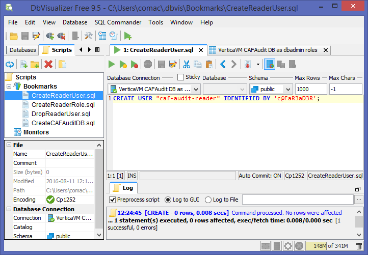

- To grant the user CAF Audit Reader Role:

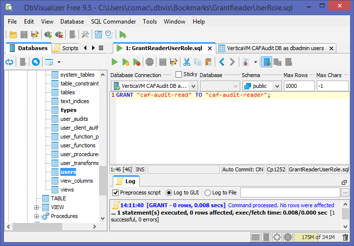

- Enable the user with the CAF Audit Reader Role:

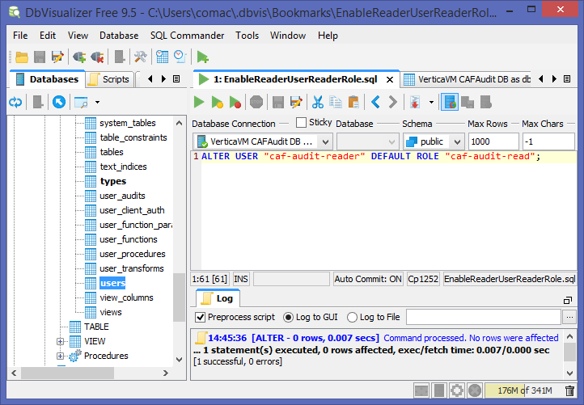

##### Create CAF Audit Service User

A service account is required for the Audit Management Web Service to create database tables for registered applications and their tenants.

- To create the CAF Audit Service User:

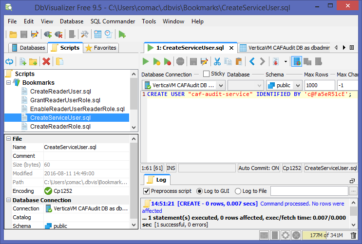

- To grant the CAF Audit Service User database CREATE permission:

##### Create CAF Audit Loader User

A loader account is required for the Kafka-Vertica Scheduler for loading audit events from Kafka into Vertica.

- To create the CAF Audit Loader User:

- To grant the CAF Audit Loader User pseudo super user role:

- To enable the CAF Audit Loader User with the pseudo super user role:

##### Modify Vertica Chateau properties

For CAF Audit Management deployments with Chateau add the Vertica host and user account details to environment/vertica.json file.

#### Prepare Vertica with Kafka-Vertica Scheduler schema

The vkconfig script, which comes pre-packaged and installed with the Vertica rpm, should be used with the *scheduler* sub-utility and *--add* option to add a schema for the Kafka-Vertica scheduler to keep track of application tenant topics:

	/opt/vertica/packages/kafka/bin/vkconfig scheduler --add 
		--config-schema auditscheduler 
		--brokers [BROKERS] 
		--username [USERNAME] 
		--password [PASSWORD] 
		--operator [OPERATOR]
	
where:

* [BROKERS] - This specifies the kafka broker(s) to be used, it is formatted as a comma separated list of address:port endpoints.
* [USERNAME] - This is the Vertica database loader account name (e.g. caf-audit-loader).
* [PASSWORD] - This is the password for the Vertica database loader account name. (e.g. "c@FaL0Ad3r")
* [OPERATOR] - This is the Vertica database loader account name wrapped in double quotes(e.g. "\"caf-audit-loader\"").

Example:

	/opt/vertica/packages/kafka/bin/vkconfig scheduler --add --config-schema auditscheduler --brokers 192.168.56.20:9092 --username caf-audit-loader --password "c@FaL0Ad3r" --operator "\"caf-audit-loader\""

##### Verification

The following figure shows the CAFAudit database with a new schema for tracking application tenant topics after running the `vkconfig scheduler --add` command:

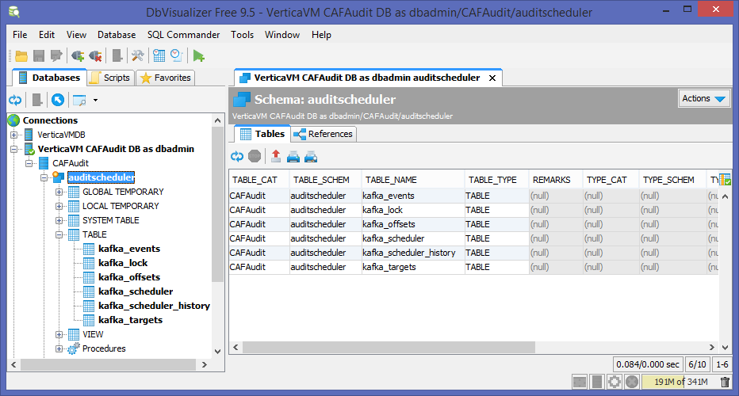

### Development Deployment

For Development deployments of Vertica it is recommended that you use [vagrant-vertica](https://github.hpe.com/caf/vagrant-vertica) and follow its supporting documentation to start a guest VM running Vertica with Vagrant.

Vagrant-vertica is not recommended for production deployments. The caveats to using it are that:

- Vertica DB usernames and passwords, used during automated installation, are held as plain text within the VM's provisioning scripts.
- It's a standalone single node setup only; provisioning scripts do not support clustered configurations.

## Deploying Kafka

Apache Kafka is a distributed, partitioned, replicated commit log service that provides messaging system functionality for producers and consumers of messages. Kafka's role in the Audit Management Service is that it receives tenant events from client-side applications (producers) as messages. On the server-side the Kafka-Vertica Scheduler (consumer) reads event messages from per application per tenant Kafka topics and streams the events into Vertica.

### Enterprise Deployment

For Enterprise deployments of Kafka it is recommended that you follow the official Apache Kafka documentation as it covers clustered deployments and topic partitioning: [Apache Kafka Documentation](http://kafka.apache.org/documentation.html)

Integration of Vertica with your Kafka broker cluster is covered in the [Official HP Vertica Documentation](https://my.vertica.com/documentation/vertica/7-2-x/)

#### Modify Kafka Chateau properties

For CAF Audit Management deployments with Chateau the Kafka broker details will need to be filled into the environment/kafka.json file.

### Development Deployment

For Development deployments of Vertica it is recommended that you use [vagrant-kafka](https://github.hpe.com/caf/vagrant-kafka) and follow its supporting documentation to start a guest VM running Kafka with Vagrant.

Vagrant-kafka is not recommended for production deployments. The caveats to using it are that:

- It's a standalone single node setup only; provisioning scripts do not support multiple machine clustered configurations.

## Deploying CAF Audit Web Service and Kafka-Vertica scheduler

### Audit Management Web Service

The Audit Management Web Service offers a REST API for CAF Audit users to register and prepare Vertica and the Kafka-Vertica Scheduler with their applications and tenants using those applications.

### Kafka-Vertica Scheduler

The Kafka-Vertica scheduler is responsible for consuming audit event messages, from per application per tenant Kafka topics, and streaming them into the appropriate Vertica database tables.

### Deployment with Chateau

**[Chateau](https://github.hpe.com/caf/chateau)** can launch CAF workers and services such as the Audit Management Web Service and the Kafka-Vertica Scheduler.

- To download and set up Chateau, follow the instructions in the [README.md](https://github.hpe.com/caf/chateau/blob/develop/README.md).

- To deploy the Audit Management Web Service and the Kafka-Vertica Scheduler, follow the [Service Deployment](https://github.hpe.com/caf/chateau/blob/develop/deployment.md) guide and use the following option with the deployment shell script: `./deploy-service.sh audit`

The following figure shows a Marathon environment running the CAF Audit services started with Chateau:

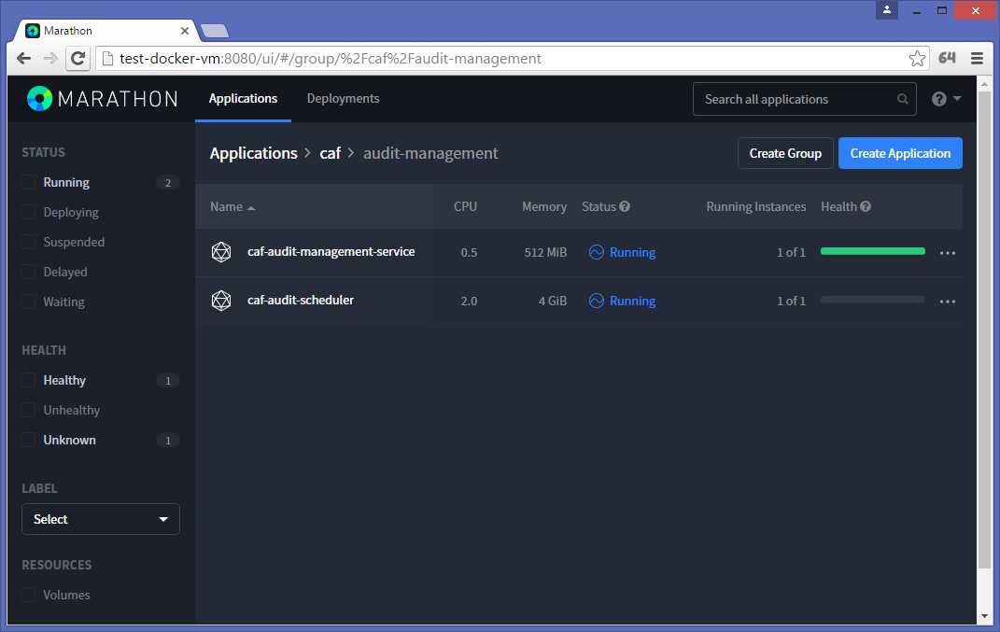

## Writing an Application Audit Event Definition File

An application for auditing requires the construction of an Audit Event Definition XML file that defines the name of the application and its events. With the use of the caf-audit-maven-plugin, the application's definition file is used to generate a client-side library that the audited application calls to log tenant events. The definition file is then also used to register the application and its events for auditing with the server-side Audit Management Web Service.

The following figure illustrates the Audit Event Definition XML File's schema.

`AuditedApplication` is the root element.

`ApplicationId` identifies the application that the Audit Events are associated with.

For each Audit Event defined, `TypeId` is a string identifier for the particular event (e.g. viewDocument) and `CategoryId` is a string identifier for the category of the event.

A list of parameter elements are then defined for each Audit Event. This includes the `Name` of the parameter, the `Type` (i.e. string, short, int, long, float, double, boolean or date) and the `Description`. The `ColumnName` element is optional which can be used to force the use of a particular database column when storing the audit data. The `Constraints` element is also optional and this can be used to specify minimum and/or maximum length constraints for audit event parameters of `Type` string.

### Using the Schema File

If you reference the XML Schema file from your Audit Event Definition File then you should be able to use the Validate functionality that is built into most IDEs and XML Editors. This will allow you to easily check for syntax errors in your Audit Event Definition File. To do this add the standard `xsi:schemaLocation` attribute to the root `AuditedApplication` element. i.e:

	<AuditedApplication xmlns="http://www.hpe.com/CAF/Auditing/Schema/AuditedApplication.xsd"
	                    xmlns:xsi="http://www.w3.org/2001/XMLSchema-instance"
	                    xsi:schemaLocation="http://www.hpe.com/CAF/Auditing/Schema/AuditedApplication.xsd http://rh7-artifactory.hpswlabs.hp.com:8081/artifactory/policyengine-release/com/hpe/caf/caf-audit-schema/1.1/caf-audit-schema-1.1.jar!/schema/AuditedApplication.xsd">

Many IDEs and XML Editors will also use the schema file to provide IntelliSense and type-ahead when the definition file is being authored.

### Example Audit Event Definition XML

The following is an example of an Audit Event Definition File that is used to throughout this getting started guide:

	<?xml version="1.0" encoding="UTF-8"?>
	<AuditedApplication xmlns="http://www.hpe.com/CAF/Auditing/Schema/AuditedApplication.xsd"
	                    xmlns:xsi="http://www.w3.org/2001/XMLSchema-instance"
	                    xsi:schemaLocation="http://www.hpe.com/CAF/Auditing/Schema/AuditedApplication.xsd http://rh7-artifactory.hpswlabs.hp.com:8081/artifactory/policyengine-release/com/hpe/caf/caf-audit-schema/1.1/caf-audit-schema-1.1.jar!/schema/AuditedApplication.xsd">
	  <ApplicationId>SampleApp</ApplicationId>
	  <AuditEvents>
	    <AuditEvent>
	      <TypeId>viewDocument</TypeId>
	      <CategoryId>documentEvents</CategoryId>
	      <Params>
	        <Param>
	          <Name>docId</Name>
	          <Type>long</Type>
	          <Description>Document Identifier</Description>
	        </Param>
	      </Params>
	    </AuditEvent>
	    <AuditEvent>
	      <TypeId>deleteDocument</TypeId>
	      <CategoryId>documentEvents</CategoryId>
	      <Params>
	        <Param>
	          <Name>docId</Name>
	          <Type>long</Type>
	          <Description>Document Identifier</Description>
	        </Param>
	        <Param>
	          <Name>authorisedBy</Name>
	          <Type>string</Type>
			  <Constraints>
				<MinLength>1</MinLength>
				<MaxLength>256</MaxLength>
			  </Constraints>
	          <Description>User who authorised the deletion</Description>
	        </Param>
	      </Params>
	    </AuditEvent>
	  </AuditEvents>
	</AuditedApplication>

## Using the Audit Management Web Service

To start using the web service, the endpoints can be exercised by accessing the Swagger Web UI at the following URL:

	http://<audit.web.service.host.address>:<port>/caf-audit-management-ui

Replace `<audit.web.service.host.address>` and `<port>` as necessary.

### Loading the XML Audit Events File

Application audit events that will occur are defined within the Audit Event Definition File which is used to register the application on the server-side. The following screenshot shows the /applications endpoint for loading this file:

#### Verification Instructions

When an application events file is registered this operation configures the Vertica database with audit management tables to record both the application specific audit events XML as well as tenants added through the service. See tables `ApplicationEvents` and `TenantApplications` under the `AuditManagement` schema in the Vertica database. An entry in the `ApplicationEvents` table will also be created to register the application events XML supplied. The following figure shows the `ApplicationEvents` table containing an entry for the SampleApp Audit Event Definition file:

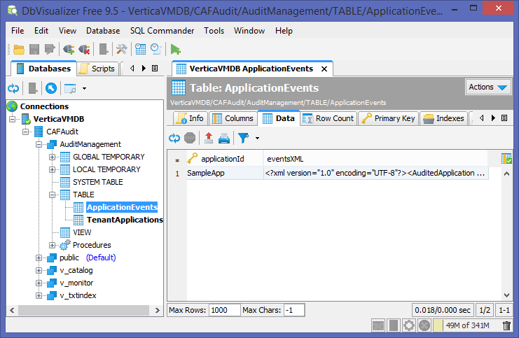

Further calls to load new application Audit Event Definition files will result in additional rows being added to the `ApplicationEvents` table.

### Adding Tenants

Once applications have been registered, tenants can then be added using the /tenants endpoint. The tenant and application identifiers need to be supplied in the call to this endpoint. It is possible to associate a tenant with more than one application by passing multiple application identifiers as a comma-separated list.

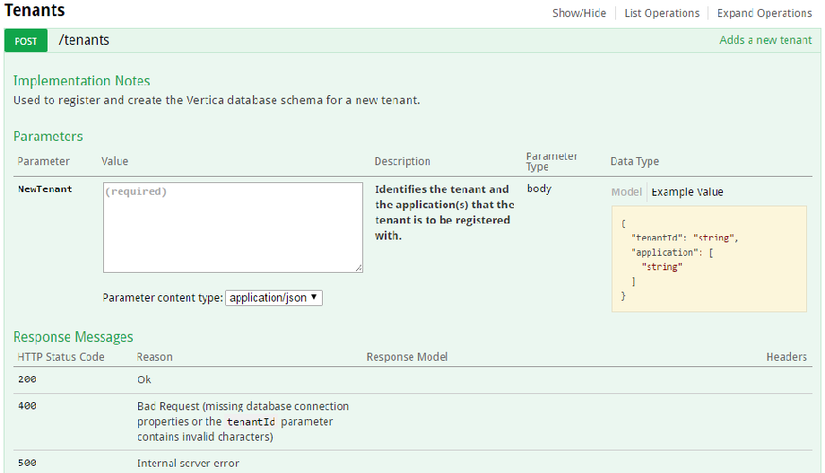

#### Verification Instructions

Every time a new tenant is added, a new row is inserted into the `TenantApplications` table under the `AuditManagement` schema. The following figure illustrates this:

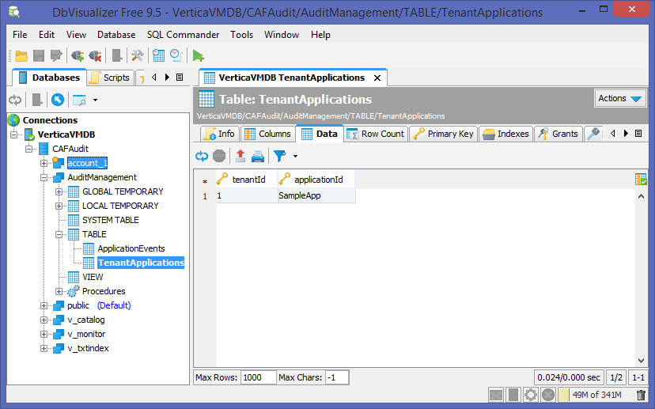

A new tenant specific database schema is then created for the tenant in the Vertica database which comprises of a number of tables. See [Auditing Database Tables](https://github.hpe.com/caf/caf-audit-management-service-container/blob/develop/documentation/auditing-database-tables.md). If the client-side auditing library has sent audit events for this tenant through to the Kafka messaging service, this audit event data should start to arrive in the application specific audit events table under the tenant specific schema created as part of the add tenant web service call.

The following figure shows an `account_1` schema with an `AuditSampleApp` table and the columns for audit event data for the application:

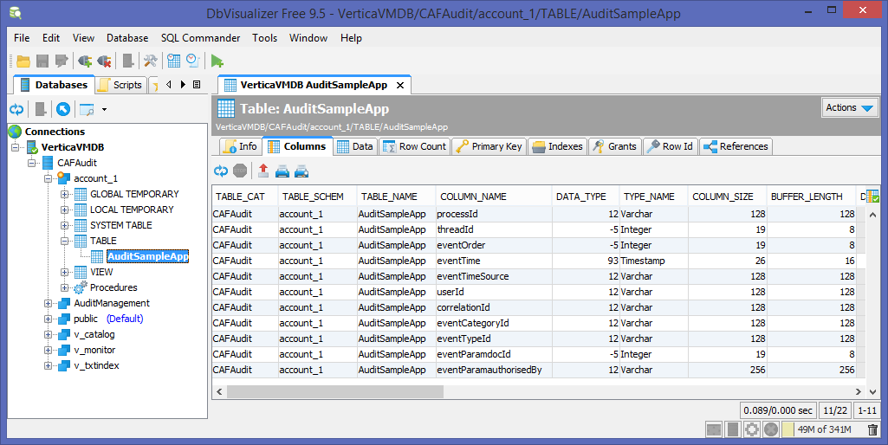

The following figure shows the `account_1` schema with a `kafka_rej` table and columns for rejected audit event data:

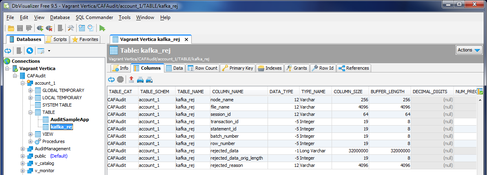

## Generating a client-side Auditing Library

As discussed above, in order to use CAF Auditing you must first define the audit events in an Audit Event Definition File. After you have created the definition file you can use it to generate a client-side library to make it easier to raise the defined audit events.

Technically you do not need to generate a client-side library in order to use CAF Auditing; you could use the caf-audit module directly, but generating a client-side library should make it easier and safer to raise events, as it should mean that each event can be raised with a single type-safe call.
Here is a sample Maven project file that generates a client-side auditing library:

	<?xml version="1.0" encoding="UTF-8"?>
	<project xmlns="http://maven.apache.org/POM/4.0.0"
         xmlns:xsi="http://www.w3.org/2001/XMLSchema-instance"
         xsi:schemaLocation="http://maven.apache.org/POM/4.0.0 http://maven.apache.org/xsd/maven-4.0.0.xsd">
	    <modelVersion>4.0.0</modelVersion>
	
	    <groupId>com.hpe.sampleapp</groupId>
	    <artifactId>sampleapp-audit</artifactId>
	    <version>1.0-SNAPSHOT</version>
	
	    <properties>
	        <project.build.sourceEncoding>UTF-8</project.build.sourceEncoding>
	        <maven.compiler.source>1.8</maven.compiler.source>
	        <maven.compiler.target>1.8</maven.compiler.target>
	    </properties>
	
	    <dependencies>
	        <dependency>
	            <groupId>com.hpe.caf</groupId>
	            <artifactId>caf-audit</artifactId>
	            <version>1.2</version>
	        </dependency>
	    </dependencies>
	
	    <build>
	        <plugins>
	            <plugin>
	                <groupId>com.hpe.caf</groupId>
	                <artifactId>caf-audit-maven-plugin</artifactId>
	                <version>1.1</version>
	                <executions>
	                    <execution>
	                        <id>generate-code</id>
	                        <phase>generate-sources</phase>
	                        <goals>
	                            <goal>xmltojava</goal>
	                        </goals>
	                    </execution>
	                </executions>
	                <configuration>
	                    <auditXMLConfig>src/main/xml/sampleapp-auditevents.xml</auditXMLConfig>
	                    <packageName>${project.groupId}.auditing</packageName>
	                </configuration>
	            </plugin>
	        </plugins>
	    </build>
	
	    <pluginRepositories>
	        <pluginRepository>
	            <id>cmbg-maven-releases</id>
	            <name>Cambridge Nexus Releases</name>
	            <url>http://cmbg-maven.autonomy.com/nexus/content/repositories/releases</url>
	            <snapshots>
	                <enabled>false</enabled>
	            </snapshots>
	        </pluginRepository>
	    </pluginRepositories>
	</project>

### Maven Coordinates

Like any other Maven project, the client-side auditing library must be assigned unique groupId, artifactId and version that can by used to reference it.

	<groupId>com.hpe.sampleapp</groupId>
	<artifactId>sampleapp-audit</artifactId>
	<version>1.0-SNAPSHOT</version>

### Dependencies

The generated library will have a dependency on caf-audit, which the generated code will use to raise the audit events. This dependency of course may introduce indirect transitive dependencies; these dependencies don't need to be directly referenced as the generated code only uses types defined in the caf-audit library.

	<dependencies>
	    <dependency>
	        <groupId>com.hpe.caf</groupId>
	        <artifactId>caf-audit</artifactId>
	        <version>1.2</version>
	    </dependency>
	</dependencies>

### Code Generation Plugin

The `xmltojava` goal of the code generation plugin is used to generate the Java auditing code that will make up the library. The `auditXMLConfig` setting can be used to define the path to the Audit Event Definition file, and the `packageName` setting can be used to set the package in which the auditing code should be generated.

	<build>
	    <plugins>
	        <plugin>
	            <groupId>com.hpe.caf</groupId>
	            <artifactId>caf-audit-maven-plugin</artifactId>
	            <version>1.1</version>
	            <executions>
	                <execution>
	                    <id>generate-code</id>
	                    <phase>generate-sources</phase>
	                    <goals>
	                        <goal>xmltojava</goal>
	                    </goals>
	                </execution>
	            </executions>
	            <configuration>
	                <auditXMLConfig>src/main/xml/sampleapp-auditevents.xml</auditXMLConfig>
	                <packageName>${project.groupId}.auditing</packageName>
	            </configuration>
	        </plugin>
	    </plugins>
	</build>

In this example the Audit Event Definition file is in the `src/main/xml/` folder, though of course it could be read from any folder. The name of the package to use is being built up by appending ".auditing" the project's group identifier (i.e. "com.hpe.sampleapp" in this example).

### Plugin Repositories

Depending on how your Maven settings.xml file is configured, the pluginRepositories section may or may not be required in order to locate the code generation plugin.

	<pluginRepositories>
	    <pluginRepository>
	        <id>cmbg-maven-releases</id>
	        <name>Cambridge Nexus Releases</name>
	        <url>http://cmbg-maven.autonomy.com/nexus/content/repositories/releases</url>
	        <snapshots>
	            <enabled>false</enabled>
	        </snapshots>
	    </pluginRepository>
	</pluginRepositories>

In this example the URL is set to [http://cmbg-maven.autonomy.com/nexus/content/repositories/releases](http://cmbg-maven.autonomy.com/nexus/content/repositories/releases), but if that location is inaccessible then you could try one of the following URLs instead:

- [http://rh7-artifactory.hpswlabs.hp.com:8081/artifactory/policyengine-release](http://rh7-artifactory.hpswlabs.hp.com:8081/artifactory/policyengine-release)
- [http://16.26.25.50/nexus/content/repositories/releases](http://16.26.25.50/nexus/content/repositories/releases)
- [http://16.103.3.109:8081/artifactory/policyengine-release](http://16.103.3.109:8081/artifactory/policyengine-release)

### No-op Auditing Library

A dummy implementation of the standard auditing library, `caf-audit`, is provided to support developers without any Apache Kafka infrastructure. It has the same interface as the standard auditing library but does not send anything to Kafka. This will allow developers to continue to work with their application without the need to install and configure Apache Kafka.

In order to make use of this no-op auditing library, simply modify the Maven Coordinates for the `caf-audit` dependency and specify `1.1-NOOP` as the version rather than just `1.1`:

	<dependencies>
	    <dependency>
	        <groupId>com.hpe.caf</groupId>
	        <artifactId>caf-audit</artifactId>
	        <version>1.1-NOOP</version>
	    </dependency>
	</dependencies>

Alternatively, you could do something more custom at runtime where you replace the standard auditing library jar with the no-op version if you prefer.

## Using the Client-side Auditing Library

### Dependencies

A generated client-side library should be referenced in the normal way in the application's POM file. You shouldn't need to manually add a dependency on `caf-audit` as it will be a transitive dependency of the generated library.

	<dependency>
	    <groupId>com.hpe.sampleapp</groupId>
	    <artifactId>sampleapp-audit</artifactId>
	    <version>1.0-SNAPSHOT</version>
	</dependency>

### Audit Connection

Regardless of whether you choose to use a generated client-side library, or to use `caf-audit` directly, you must first create an `AuditConnection` object.

This object represents a logical connection to the persistent storage (i.e. to Kafka in the current implementation). It is a thread-safe object. It should be considered that this object takes some time to construct, so the application should hold on to it and re-use it rather than constantly re-constructing it.

The `AuditConnection` object can be constructed using the static `createConnection()` method in the `AuditConnectionFactory` class. This method takes a `ConfigurationSource` parameter, which is the standard method of configuration in CAF.

#### Configuration in CAF

You may already have a CAF Configuration Source in your application. It is a general framework that abstracts away the source of the configuration, allowing it to come from environment variables, files, a REST service, or potentially a custom source which better integrates with the host application.

If you're not already using CAF's Configuration mechanism, then here is some sample code to generate a `ConfigurationSource` object.

	import com.hpe.caf.api.*;
	import com.hpe.caf.cipher.NullCipherProvider;
	import com.hpe.caf.config.system.SystemBootstrapConfiguration;
	import com.hpe.caf.naming.ServicePath;
	import com.hpe.caf.util.ModuleLoader;
	
	public static ConfigurationSource createCafConfigSource() throws Exception
	{
	    System.setProperty("CAF_CONFIG_PATH", "/etc/sampleapp/config");
	    System.setProperty("CAF_APPNAME", "sampleappgroup/sampleapp");
	
	    BootstrapConfiguration bootstrap = new SystemBootstrapConfiguration();
	    Cipher cipher = ModuleLoader.getService(CipherProvider.class, NullCipherProvider.class).getCipher(bootstrap);
	    ServicePath path = bootstrap.getServicePath();
	    Codec codec = ModuleLoader.getService(Codec.class);
	    return ModuleLoader.getService(ConfigurationSourceProvider.class).getConfigurationSource(bootstrap, cipher, path, codec);
	}

To compile the above sample code you will need to add the following dependencies to your POM:

	<dependency>
	    <groupId>com.hpe.caf</groupId>
	    <artifactId>caf-api</artifactId>
	    <version>11.2</version>
	</dependency>
	<dependency>
	    <groupId>com.hpe.caf.cipher</groupId>
	    <artifactId>cipher-null</artifactId>
	    <version>10.0</version>
	</dependency>
	<dependency>
	    <groupId>com.hpe.caf.config</groupId>
	    <artifactId>config-system</artifactId>
	    <version>10.0</version>
	</dependency>
	<dependency>
	    <groupId>com.hpe.caf.util</groupId>
	    <artifactId>util-moduleloader</artifactId>
	    <version>1.1</version>
	</dependency>
	<dependency>
	    <groupId>com.hpe.caf.util</groupId>
	    <artifactId>util-naming</artifactId>
	    <version>1.0</version>
	</dependency>

To use JSON-encoded files for your configuration you will need to add the following additional dependencies to your POM:

	<!-- Runtime-only Dependencies -->
	<dependency>
	    <groupId>com.hpe.caf.config</groupId>
	    <artifactId>config-file</artifactId>
	    <version>10.0</version>
	    <scope>runtime</scope>
	</dependency>
	<dependency>
	    <groupId>com.hpe.caf.codec</groupId>
	    <artifactId>codec-json</artifactId>
	    <version>10.1</version>
	    <scope>runtime</scope>
	</dependency>
	<dependency>
	    <groupId>io.dropwizard</groupId>
	    <artifactId>dropwizard-core</artifactId>
	    <version>0.8.4</version>
	    <scope>runtime</scope>
	</dependency>

#### Configuration Required to create the AuditConnection

In the above sample CAF Configuration is using JSON-encoded files with the following parameters:

- `CAF_CONFIG_PATH: /etc/sampleapp/config`
- `CAF_APPNAME: sampleappgroup/sampleapp`

Given this configuration, to configure CAF Auditing you should create a file named `cfg_sampleappgroup_sampleapp_KafkaAuditConfiguration` in the `/etc/sampleapp/config/` directory. The contents of this file should be similar to the following:

	{
	    "bootstrapServers": "192.168.56.20:9092",
	    "acks": "all",
	    "retries": "0"
	}

`bootstrapServers` refers to one or more of the nodes of the Kafka cluster as a comma-separated list.
`acks` is the number of nodes in the cluster which must acknowledge an audit event when it is sent.

### Audit Channel

After you have successfully constructed an `AuditConnection` object you must construct an `AuditChannel` object.

This object represents a logical channel to the persistent storage (i.e. to Kafka in the current implementation). It is NOT a thread-safe object so it must not be shared across threads without synchronisation. However there is no issue constructing multiple `AuditChannel` objects simultaneously on different threads, and the objects are lightweight so caching them is not that important.

The `AuditChannel` object can be constructed using the `createChannel()` method on the `AuditConnectionn` object. It does not take any parameters.

### Audit Log

The generated library contains an `AuditLog` class which contains static methods which can be used to log audit events.

Here is an example for a the SampleApp's `viewDocument` event which takes a single document identifier parameter:

	/**
	 * Audit the viewDocument event
	 * @param channel Identifies the channel to be used for message queuing 
	 * @param tenantId Identifies the tenant that the user belongs to 
	 * @param userId Identifies the user who triggered the event 
	 * @param correlationId Identifies the same user action 
	 * @param docId Document Identifier 
	 */
	public static void auditViewDocument
	(
	    final AuditChannel channel,
	    final String tenantId,
	    final String userId,
	    final String correlationId,
	    final long docId
	)
	    throws Exception
	{
	    final AuditEventBuilder auditEventBuilder = channel.createEventBuilder();
	    auditEventBuilder.setApplication(APPLICATION_IDENTIFIER);
	    auditEventBuilder.setTenant(tenantId);
	    auditEventBuilder.setUser(userId);
	    auditEventBuilder.setCorrelationId(correlationId);
	    auditEventBuilder.setEventType("documentEvents", "viewDocument");
	    auditEventBuilder.addEventParameter("docId", null, docId);
	
	    auditEventBuilder.send();
	}

The name of the event is included in the generated method name. In addition to the custom parameters (document id in this case), the caller must pass the `AuditChannel` object to be used, as well as the tenant id, user id, and correlation id.

The method will throw an Exception if the audit event could not be stored for some reason (e.g. network failure).

### Verification Instructions

Every time an `AuditLog` method is called a new row will be entered into the tenant's audit application table. The following figure shows the a tenant's `account_1` schema's `AuditSampleApp` table with an audit event entry with data for an audit event:

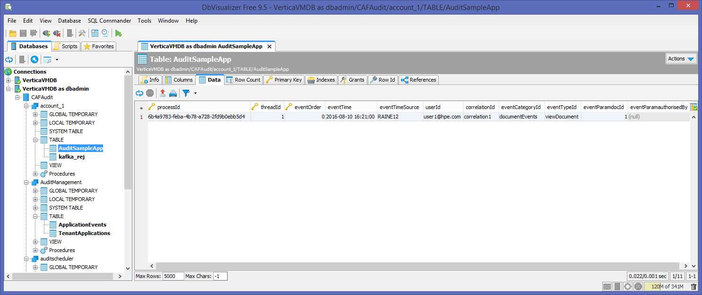

---

## Links

For more information on Chateau, go [here](https://github.hpe.com/caf/chateau).

For more information on Vertica, go [here](https://my.vertica.com/).

For more information on Apache Kafka, go [here](http://kafka.apache.org/).