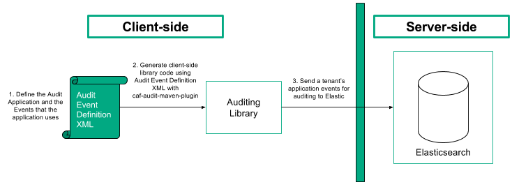

# Architecture

The Audit library logs audit event metadata, belonging to tenant applications, into Elasticsearch.

In order to use Auditing with an application, you must first specify the audit events that the application uses and the parameters that you want to associate with each of the events. The events are specified in an XML file known as the audit event definition file and are used to generate an application-specific, client-side auditing library that sends the application events for auditing to Elasticsearch.

Elasticsearch receives CAF audit events for a tenant from the client-side library and adds the application audit event to the tenant's index.

## Overview

Auditing is built on Elasticsearch for the messaging and storage of the audit events. Elasticsearch offers high availability, throughput, scalability, and performance to the overall solution. Additionally, Elasticsearch is accessible via RESTful APIs, it offers strong data analytics and monitoring capabilities.

### Audit Service Component Architecture

The figure below illustrates the overall flow and relationship of components in the Audit service.

1. Setting up your application for Auditing requires defining an audit event definition XML file. The file is used for the generation of the client-side audit library.
2. Using the `caf-audit-maven-plugin`, the client-side Java library is generated from the audit event definition XML file.
3. The audited application makes calls to the generated client-side library to send audit events to Elasticsearch. An Audit event is stored in the tenant index belonging to the application that made the call.

### Audit Event Definition File

In order to use Auditing in an application, the application's auditing events must be specified along with the parameters that are associated with each of the events. These events are specified in an audit event definition file. You can read more about the audit event definition file and its XML schema in the [Getting Started Guide](Getting-Started.md).

### Elasticsearch Indices and Type Mappings

On the audited application's first call to the Audit library, an index is created for the tenant if it does not already exist. A tenant's Elasticsearch index and type meta-field identifiers are seen as:

| Elasticsearch meta-field identifiers | Audit ES meta-field identifiers |                                                     Description |
|--------------------------------------|:-------------------------------:|----------------------------------------------------------------:|
| index                                |         <tenantId>_audit        | The index to which the tenant applications' audit events belong |
| type                                 |          cafAuditEvent          |             The tenant applications' audit events mapping type  |

You can read more about Elasticsearch meta-field identifiers [here](https://www.elastic.co/guide/en/elasticsearch/reference/current/mapping-fields.html).

The following JSON, returned from Elasticsearch, illustrates the `cafAuditEvent` field type mappings for an index belonging to a tenant whose ID is `1`. Audit event information is stored in fixed fields and the event parameters are mapped to appropriate types based on field name suffixes added by the Audit library.

    GET /1_audit/_mapping/cafAuditEvent
    {
      "1_audit": {
        "mappings": {
          "cafAuditEvent": {
            "dynamic_templates": [
              {
                "CAFAuditKeyword": {
                  "match": "*_CAKyw",
                  "mapping": {
                    "type": "keyword"
                  }
                }
              },
              {
                "CAFAuditText": {
                  "match": "*_CATxt",
                  "mapping": {
                    "type": "text"
                  }
                }
              },
              {
                "CAFAuditLong": {
                  "match": "*_CALng",
                  "mapping": {
                    "type": "long"
                  }
                }
              },
              {
                "CAFAuditInteger": {
                  "match": "*_CAInt",
                  "mapping": {
                    "type": "integer"
                  }
                }
              },
              {
                "CAFAuditShort": {
                  "match": "*_CAShort",
                  "mapping": {
                    "type": "short"
                  }
                }
              },
              {
                "CAFAuditDouble": {
                  "match": "*_CADbl",
                  "mapping": {
                    "type": "double"
                  }
                }
              },
              {
                "CAFAuditFloat": {
                  "match": "*_CAFlt",
                  "mapping": {
                    "type": "float"
                  }
                }
              },
              {
                "CAFAuditDate": {
                  "match": "*_CADte",
                  "mapping": {
                    "type": "date"
                  }
                }
              },
              {
                "CAFAuditBoolean": {
                  "match": "*_CABln",
                  "mapping": {
                    "type": "boolean"
                  }
                }
              }
            ],
            "properties": {
              "applicationId": {
                "type": "keyword"
              },
              "correlationId": {
                "type": "keyword"
              },
              "eventCategoryId": {
                "type": "keyword"
              },
              "eventOrder": {
                "type": "long"
              },
              "eventTime": {
                "type": "date"
              },
              "eventTimeSource": {
                "type": "keyword"
              },
              "eventTypeId": {
                "type": "keyword"
              },
              "processId": {
                "type": "keyword"
              },
              "threadId": {
                "type": "long"
              },
              "userId": {
                "type": "keyword"
              }
            }
          }
        }
      }
    }

A tenant application's audit events are sent from the client-side library to Elasticsearch and added to the index created for the tenant.

The following JSON, returned from Elasticsearch, illustrates all of the application audit events belonging to the `1_audit` index. In other words each hit displayed is an audit event message belonging to a tenant application.

    GET /1_audit/cafAuditEvent/_search
    {
      "took": 3,
      "timed_out": false,
      "_shards": {
        "total": 5,
        "successful": 5,
        "failed": 0
      },
      "hits": {
        "total": 2,
        "max_score": 1,
        "hits": [
          {
            "_index": "1_audit",
            "_type": "cafAuditEvent",
            "_id": "AVuvyhWuI0NChd-OZTz-",
            "_score": 1,
            "_source": {
              "processId": "a040cdab-778d-4634-8b64-4fe4deedaa93",
              "threadId": "1",
              "eventOrder": "1",
              "eventTime": "2016-11-15T14:30:00",
              "eventTimeSource": "HOST1",
              "userId": "JoeBloggs@yourcompany.com",
              "correlationId": "correlation1",
              "eventCategoryId": "documentEvents",
              "eventTypeId": "deleteDocument",
              "applicationId": "DocumentWebServiceApp",
              "docId_CALng": "123456",
              "authorisedBy_CAKyw": "JoesphBloggins@yourcompany.com"
            }
          },
          {
            "_index": "1_audit",
            "_type": "cafAuditEvent",
            "_id": "AVuvySPNI0NChd-OZTzH",
            "_score": 1,
            "_source": {
              "processId": "a040cdab-778d-4634-8b64-4fe4deedaa93",
              "threadId": "1",
              "eventOrder": "0",
              "eventTime": "2016-11-15T14:12:12",
              "eventTimeSource": "HOST1",
              "userId": "JoeBloggs@yourcompany.com",
              "correlationId": "correlation1",
              "eventCategoryId": "documentEvents",
              "eventTypeId": "viewDocument",
              "applicationId": "DocumentWebServiceApp",
              "docId_CALng": "123456"
            }
          }
        ]
      }
    }
