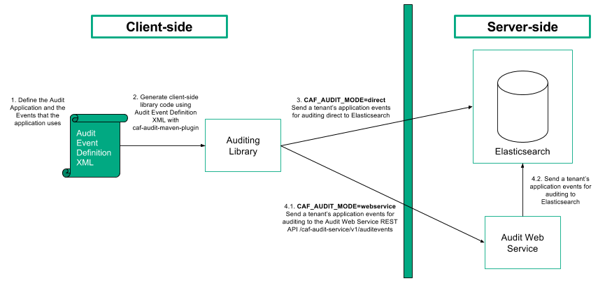

# Architecture

## Overview

The Audit library logs audit event metadata, belonging to tenant applications, into Elasticsearch directly or via the Audit Web Service REST API.

In order to use Auditing with an application, you must first specify the audit events that the application uses and the parameters that you want to associate with each of the events. The events are specified in an XML file known as the audit event definition file and are used to generate an application-specific, client-side auditing library that sends the application events for auditing to either Elasticsearch directly or via the Audit Web Service REST API.

Auditing is built on Elasticsearch for the messaging and storage of audit events. Elasticsearch offers high availability, throughput, scalability, and performance to the overall solution. Additionally, Elasticsearch is accessible via RESTful APIs, it offers strong data analytics and monitoring capabilities.

Elasticsearch receives application audit events for a tenant and stores them in the tenant's index.

## Audit Service Component Architecture

The figure below illustrates the Audit service flow and relationship of components when the Auditing library is set-up to communicate directly with Elasticsearch or with the Audit Web Service REST API.

1. Setting up your application for Auditing requires defining an audit event definition XML file. The file is used for the generation of the client-side audit library.
2. Using the `caf-audit-maven-plugin`, the client-side Java library is generated from the audit event definition XML file.
3. If the Auditing library is configured in direct to elasticsearch mode, environment variable `CAF_AUDIT_MODE` set to `elasticsearch` and the caf-audit-binding-elasticsearch jar available at runtime, the audited application makes calls to the generated client-side library to build and send audit events to Elasticsearch. An Audit event is stored in the tenant index belonging to the application that made the call.  
4. If the Auditing library is configured as Web Service client mode, environment variable `CAF_AUDIT_MODE` set to `webservice` and the caf-audit-binding-webservice jar available at run time.
	1. The audited application makes calls to the generated client-side library to build and send audit events to the Audit Web Service REST API, `/caf-audit-service/v1/auditevents` path, endpoint.
	2. The Audit Web Service makes calls to Elasticsearch to store audit events received from the client. Each audit event is stored in the tenant index belonging to the application that made the call.

## Audit Event Definition File

In order to use Auditing in an application, the application's auditing events must be specified along with the parameters that are associated with each of the events. These events are specified in an audit event definition file. You can read more about the audit event definition file and its XML schema in the [Getting Started Guide](Getting-Started).

## Auditing Library

The Auditing library can be configured to build and send audit events directly to Elasticsearch, which is covered in the Getting Started guide [here](Getting-Started), or via the Audit Web Service API, which is covered in the Web Service guide [here](Web-Service).

## Audit Web Service

The Audit Web Service API provides a RESTful interface for indexing audit event messages into Elasticsearch. Audit events, in the form of REST POST JSON requests, are sent to the Audit Web Service API which then connects to Elasticsearch and indexes the details of the audit event message for the tenant application.

For more information on the Audit Web Service, go [here](Web-Service).

## Elasticsearch Indexing

In the context of the Audit service, an Elasticsearch index holds audit events belonging to a tenant's applications under predefined field value type mappings. You can read more about Elasticsearch index and type meta-field identifiers [here](https://www.elastic.co/guide/en/elasticsearch/reference/current/mapping-fields.html).

### Tenant Index

On an audited application's first call to the Audit library, an index is created for the tenant if it does not already exist. The tenant index naming scheme is `<tenantId>_audit` and it holds application audit events that belong to the tenant.

#### Index Type Mappings

When an Audit event is added to a tenant's index its parameters are mapped to fields based on their names and stored with the corresponding datatypes. The datatypes that an audit event's parameters should map to are defined within the `cafAuditEvent` field type mappings.

The following JSON, returned from Elasticsearch with a REST command, illustrates the `cafAuditEvent` field type mappings for an index belonging to a tenant whose ID is `00000001`.

    GET http://<Elasticsearch_Host>:9200/00000001_audit/_mapping/cafAuditEvent
    {
      "00000001_audit": {
        "mappings": {
          "cafAuditEvent": {
            "dynamic_templates": [
              {
                "CAFAuditKeyword": {
                  "match": "*_CAKyw",
                  "mapping": {
                    "type": "keyword"
                  }
                }
              },
              {
                "CAFAuditText": {
                  "match": "*_CATxt",
                  "mapping": {
                    "type": "text"
                  }
                }
              },
              {
                "CAFAuditLong": {
                  "match": "*_CALng",
                  "mapping": {
                    "type": "long"
                  }
                }
              },
              {
                "CAFAuditInteger": {
                  "match": "*_CAInt",
                  "mapping": {
                    "type": "integer"
                  }
                }
              },
              {
                "CAFAuditShort": {
                  "match": "*_CAShort",
                  "mapping": {
                    "type": "short"
                  }
                }
              },
              {
                "CAFAuditDouble": {
                  "match": "*_CADbl",
                  "mapping": {
                    "type": "double"
                  }
                }
              },
              {
                "CAFAuditFloat": {
                  "match": "*_CAFlt",
                  "mapping": {
                    "type": "float"
                  }
                }
              },
              {
                "CAFAuditDate": {
                  "match": "*_CADte",
                  "mapping": {
                    "type": "date"
                  }
                }
              },
              {
                "CAFAuditBoolean": {
                  "match": "*_CABln",
                  "mapping": {
                    "type": "boolean"
                  }
                }
              }
            ],
            "properties": {
              "applicationId": {
                "type": "keyword"
              },
              "correlationId": {
                "type": "keyword"
              },
              "eventCategoryId": {
                "type": "keyword"
              },
              "eventOrder": {
                "type": "long"
              },
              "eventTime": {
                "type": "date"
              },
              "eventTimeSource": {
                "type": "keyword"
              },
              "eventTypeId": {
                "type": "keyword"
              },
              "processId": {
                "type": "keyword"
              },
              "threadId": {
                "type": "long"
              },
              "userId": {
                "type": "keyword"
              }
            }
          }
        }
      }
    }

Audit event parameters are mapped and stored within the index based on the field names that they match within the `cafAuditEvent` type mapping definition.

- `properties` : each of these are audit event parameter field names, present in all audit events, with the datatypes in which they are to be stored.
- `dynamic_templates` : each of these are potential audit event parameter field names suffixed with a datatype identifier. An audit event parameter field name that matches a dynamic field is stored with the corresponding datatype.

Using `dynamic_templates` means that audit event parameters can be stored in a type-safe manner, otherwise Elasticserach automatically assumes the datatype, based on the value, when a it encounters a new field. You can read more about Elasticsearch dynamic templates [here](https://www.elastic.co/guide/en/elasticsearch/reference/current/dynamic-templates.html).

#### Tenant Index Example

A tenant application's audit events are sent from the client-side library to Elasticsearch and added to the index created for the tenant.

The following JSON, returned from Elasticsearch, illustrates all of the audit events belonging to the `00000001_audit` index. Each hit displayed is an audit event message belonging to a tenant application.

    GET http://<Elasticsearch_Host>:9200/00000001_audit/cafAuditEvent/_search
    {
      "took": 3,
      "timed_out": false,
      "_shards": {
        "total": 5,
        "successful": 5,
        "failed": 0
      },
      "hits": {
        "total": 2,
        "max_score": 1,
        "hits": [
          {
            "_index": "00000001_audit",
            "_type": "cafAuditEvent",
            "_id": "AVuvyhWuI0NChd-OZTz-",
            "_score": 1,
            "_source": {
              "processId": "a040cdab-778d-4634-8b64-4fe4deedaa93",
              "threadId": "1",
              "eventOrder": "1",
              "eventTime": "2016-11-15T14:30:00",
              "eventTimeSource": "HOST1",
              "userId": "JoeBloggs@yourcompany.com",
              "correlationId": "correlation1",
              "eventCategoryId": "documentEvents",
              "eventTypeId": "deleteDocument",
              "applicationId": "DocumentWebServiceApp",
              "docId_CALng": "123456",
              "authorisedBy_CAKyw": "JoesphBloggins@yourcompany.com"
            }
          },
          {
            "_index": "00000001_audit",
            "_type": "cafAuditEvent",
            "_id": "AVuvySPNI0NChd-OZTzH",
            "_score": 1,
            "_source": {
              "processId": "a040cdab-778d-4634-8b64-4fe4deedaa93",
              "threadId": "1",
              "eventOrder": "0",
              "eventTime": "2016-11-15T14:12:12",
              "eventTimeSource": "HOST1",
              "userId": "JoeBloggs@yourcompany.com",
              "correlationId": "correlation1",
              "eventCategoryId": "documentEvents",
              "eventTypeId": "viewDocument",
              "applicationId": "DocumentWebServiceApp",
              "docId_CALng": "123456"
            }
          }
        ]
      }
    }
