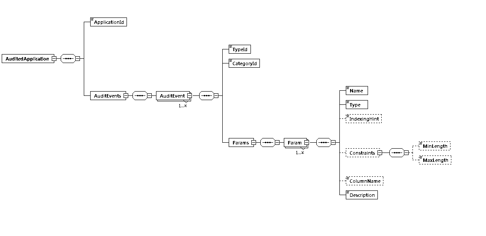
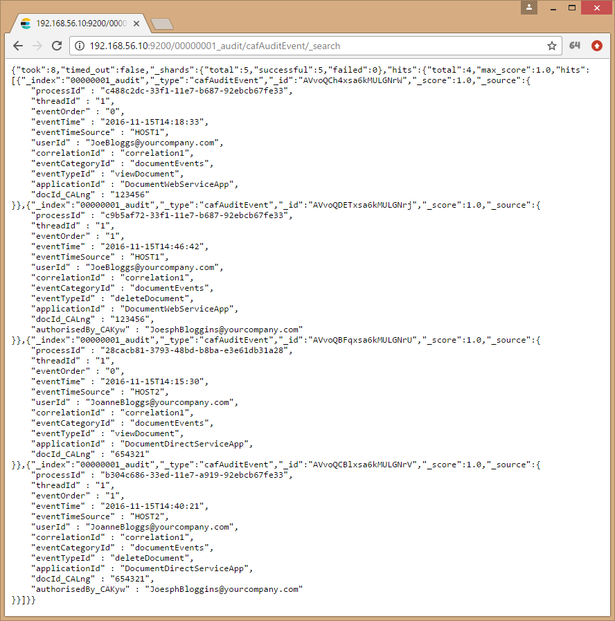
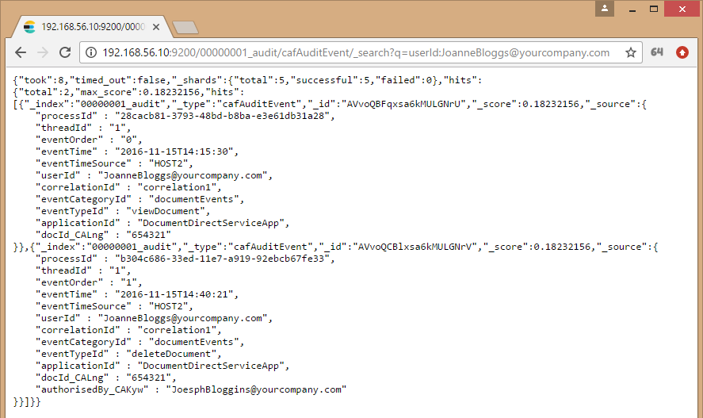

# Getting Started

You need to perform the following steps to set up the Audit service.

1. Use the [Audit Service Deploy Project](https://github.com/CAFAudit/audit-service-deploy), to launch an Elasticsearch cluster.
2. Define an application's audit events in an Audit Event Definition File.
3. Generate the client-side auditing library using the audit event definition file and the code generation plugin. 
4. In your application, use the client-side auditing library to send audit events to Elasticsearch.

These steps are explained in more detail in  subsequent sections:

- [Deploying Elasticsearch](#deploying-elasticsearch)
- [Writing an Application Audit Event Definition File](#writing-an-application-audit-event-definition-file)
- [Generating a Client-side Auditing Library](#generating-a-client-side-auditing-library)
- [Using the Client-side Auditing Library](#using-the-client-side-auditing-library)

For more information on Audit Service Deploy, go [here](https://github.com/CAFAudit/audit-service-deploy).

For more information on Elasticsearch, go [here](https://www.elastic.co/products/elasticsearch/).

## Deploying Elasticsearch

Elasticsearch is a datastore designed for delivering speed, scalability, availability and analytics. In the Auditing service, Elasticsearch ultimately stores the audit events belonging to tenant applications. You can then use Elasticsearch's vast query capabilities to perform analytics on audited application data.

For developer deployment of Elasticsearch, please follow the Audit Service Deployment documentation. The documentation covers configuring and starting of an Elasticsearch cluster in Docker. For more information on Audit Service Deployment, go [here](https://github.com/CAFAudit/audit-service-deploy).

## Writing an Application Audit Event Definition File

An application for auditing requires the construction of an audit event definition XML file that defines the name of the application and its events. With the use of the caf-audit-maven-plugin, the application's definition file is used to generate a client-side library that the audited application calls to log tenant events.

The following figure illustrates the audit event definition XML file's schema.

where:

`AuditedApplication` is the root element.

`ApplicationId` identifies the application with which the audit events are associated.

For each audit event, `TypeId` is a string identifier for the particular event (for example, viewDocument) and `CategoryId` is a string identifier for the category of the event.

A list of parameter elements are then defined for each audit event, including the following:
- `Name`
- `Type` (string, short, int, long, float, double, boolean or date)
- `Description`
- `IndexingHint` (optional) can be used to specify an indexing hint (fulltext or keyword) when storing audit event parameter data of `Type` string.
- `ColumnName` (optional) can be used to force the use of a particular database column to store the audit data. 
- `Constraints` (optional) can be used to specify minimum and/or maximum length constraints for audit event parameters of `Type` string.

### Using the Schema File

If you reference the XML schema file from your audit event definition file, then you should be able to use the validate functionality that is built into most IDEs and XML editors. Validate allows you to easily check for syntax errors in your audit event definition file. Just add the standard `xsi:schemaLocation` attribute to the root `AuditedApplication` element:

	<AuditedApplication xmlns="https://cafaudit.github.io/audit-service/schema/AuditedApplication.xsd"
	                    xmlns:xsi="http://www.w3.org/2001/XMLSchema-instance"
	                    xsi:schemaLocation="https://cafaudit.github.io/audit-service/schema/AuditedApplication.xsd https://raw.githubusercontent.com/CAFAudit/audit-service/v3.1.0/caf-audit-schema/src/main/resources/schema/AuditedApplication.xsd">	                   

Many IDEs and XML editors use the schema file to provide IntelliSense / Auto-Complete when authoring the definition file.

### Example Audit Event Definition XML

The following is an example of an audit event definition file used throughout this guide:

	<?xml version="1.0" encoding="UTF-8"?>
	<AuditedApplication xmlns="https://cafaudit.github.io/audit-service/schema/AuditedApplication.xsd"
	                    xmlns:xsi="http://www.w3.org/2001/XMLSchema-instance"
	                    xsi:schemaLocation="https://cafaudit.github.io/audit-service/schema/AuditedApplication.xsd https://raw.githubusercontent.com/CAFAudit/audit-service/v3.1.0/caf-audit-schema/src/main/resources/schema/AuditedApplication.xsd">
	  <ApplicationId>SampleApp</ApplicationId>
	  <AuditEvents>
	    <AuditEvent>
	      <TypeId>viewDocument</TypeId>
	      <CategoryId>documentEvents</CategoryId>
	      <Params>
	        <Param>
	          <Name>docId</Name>
	          <Type>long</Type>
	          <Description>Document Identifier</Description>
	        </Param>
	      </Params>
	    </AuditEvent>
	    <AuditEvent>
	      <TypeId>deleteDocument</TypeId>
	      <CategoryId>documentEvents</CategoryId>
	      <Params>
	        <Param>
	          <Name>docId</Name>
	          <Type>long</Type>
	          <Description>Document Identifier</Description>
	        </Param>
	        <Param>
	          <Name>authorisedBy</Name>
	          <Type>string</Type>
	          <IndexingHint>keyword</IndexingHint>
	          <Constraints>
	            <MinLength>1</MinLength>
	            <MaxLength>256</MaxLength>
	          </Constraints>
	          <Description>User who authorised the deletion</Description>
	        </Param>
	      </Params>
	    </AuditEvent>
	  </AuditEvents>
	</AuditedApplication>

## Generating a Client-side Auditing Library

As previously mentioned, in order to use Auditing, you must first define the audit events in an audit event definition file. After you create the definition file, you use it to generate a client-side library. Technically, you do not need to generate a client-side library to use Auditing; you could use the `caf-audit` module directly; read more on the using the library directly, [here](Client-API). However, generating a client-side library should make it easier and safer to raise events because each event can be raised with a single type-safe call.

The following sample Maven project file generates a client-side auditing library:

	<?xml version="1.0" encoding="UTF-8"?>
	<project xmlns="http://maven.apache.org/POM/4.0.0"
         xmlns:xsi="http://www.w3.org/2001/XMLSchema-instance"
         xsi:schemaLocation="http://maven.apache.org/POM/4.0.0 http://maven.apache.org/xsd/maven-4.0.0.xsd">
	    <modelVersion>4.0.0</modelVersion>
	
	    <groupId>com.hpe.sampleapp</groupId>
	    <artifactId>sampleapp-audit</artifactId>
	    <version>1.0.0-SNAPSHOT</version>
	
	    <properties>
	        <project.build.sourceEncoding>UTF-8</project.build.sourceEncoding>
	        <maven.compiler.source>1.8</maven.compiler.source>
	        <maven.compiler.target>1.8</maven.compiler.target>
	    </properties>
	
	    <dependencies>
	        <dependency>
	            <groupId>com.github.cafaudit</groupId>
	            <artifactId>caf-audit</artifactId>
	            <version>3.1.0</version>
	        </dependency>
	    </dependencies>
	
	    <build>
	        <plugins>
	            <plugin>
	                <groupId>com.github.cafaudit</groupId>
	                <artifactId>caf-audit-maven-plugin</artifactId>
	                <version>3.1.0</version>
	                <executions>
	                    <execution>
	                        <id>generate-code</id>
	                        <phase>generate-sources</phase>
	                        <goals>
	                            <goal>xmltojava</goal>
	                        </goals>
	                    </execution>
	                </executions>
	                <configuration>
	                    <auditXMLConfig>src/main/xml/sampleapp-auditevents.xml</auditXMLConfig>
	                    <packageName>${project.groupId}.auditing</packageName>
	                </configuration>
	            </plugin>
	        </plugins>
	    </build>
	</project>

### Maven Coordinates

Like any other Maven project, the client-side auditing library must be assigned a unique groupId, artifactId, and version, which are used to reference it.

	<groupId>com.hpe.sampleapp</groupId>
	<artifactId>sampleapp-audit</artifactId>
	<version>1.0.0-SNAPSHOT</version>

### Dependencies

The generated library has a dependency on `caf-audit`, which the generated code uses to raise the audit events. This dependency, of course, may introduce indirect, transitive dependencies; these dependencies don't need to be directly referenced as the generated code only uses types defined in the `caf-audit` library.

	<dependencies>
	    <dependency>
	        <groupId>com.github.cafaudit</groupId>
	        <artifactId>caf-audit</artifactId>
	        <version>3.1.0</version>
	    </dependency>
	</dependencies>  

The library for audit must also take a dependency on either the webservice, elasticsearch or both auditing implementations. These jars must be available to the client at runtime.  

	<dependencies>
	    <dependency>
	        <groupId>com.github.cafaudit</groupId>
	        <artifactId>caf-audit-binding-elasticsearch</artifactId>
	        <version>3.3.0-SNAPSHOT</version>
                <scope>runtime</scope>
	    </dependency>
	    <dependency>
	        <groupId>com.github.cafaudit</groupId>
	        <artifactId>caf-audit-binding-webservice</artifactId>
	        <version>3.3.0-SNAPSHOT</version>
                <scope>runtime</scope>
	    </dependency>
	</dependencies>

### Code Generation Plugin

The `xmltojava` goal of the code generation plugin is used to generate the Java auditing code that makes up the library. The `auditXMLConfig` setting defines the path to the audit event definition file, and the `packageName` setting sets the package in which the auditing code should be generated.

	<build>
	    <plugins>
	        <plugin>
	            <groupId>com.github.cafaudit</groupId>
	            <artifactId>caf-audit-maven-plugin</artifactId>
	            <version>3.1.0</version>
	            <executions>
	                <execution>
	                    <id>generate-code</id>
	                    <phase>generate-sources</phase>
	                    <goals>
	                        <goal>xmltojava</goal>
	                    </goals>
	                </execution>
	            </executions>
	            <configuration>
	                <auditXMLConfig>src/main/xml/sampleapp-auditevents.xml</auditXMLConfig>
	                <packageName>${project.groupId}.auditing</packageName>
	            </configuration>
	        </plugin>
	    </plugins>
	</build>

In this example, the audit event definition file is in the `src/main/xml/` folder, though, it could be read from any folder. The name of the package to use is built up by appending ".auditing" to the project's group identifier (that is, "com.hpe.sampleapp" in this example).

## Using the Client-side Auditing Library

Once you have your auditing library (generated or `caf-audit`), you use it to send audit events to Elasticsearch.

### Dependencies

A generated client-side library should be referenced in the normal way in the application's POM file. You shouldn't need to manually add a dependency on `caf-audit` as it will be a transitive dependency of the generated library.

	<dependency>
	    <groupId>com.hpe.sampleapp</groupId>
	    <artifactId>sampleapp-audit</artifactId>
	    <version>1.0.0-SNAPSHOT</version>
	</dependency>

### Audit Connection

Regardless of whether you choose to use a generated client-side library, or to use `caf-audit` directly, you must first create an `AuditConnection` object.

This object represents a logical connection to the datastore (that is, Elasticsearch in the current implementation). It is a thread-safe object. ***Please take into account that this object requires some time to construct. The application should hold on to it and re-use it, rather than constantly re-construct it.***

The `AuditConnection` object, for direct to Elasticseach, can be constructed by setting the `CAF_AUDIT_MODE` environment variable to `elasticsearch` and then using one of the static `createConnection()` methods in the `AuditConnectionFactory` class:  
- `createConnection()` method has no parameters and requires the following environment variables to be set when creating a connection for direct to Elasticsearch:
        - `CAF_ELASTIC_HOST_AND_PORT_VALUES` refers to one or more of the nodes of the Elasticsearch cluster as a comma-separated list.
        - `CAF_ELASTIC_NUMBER_OF_SHARDS` the number of primary shards that an index should have. Defaults to 5.
        - `CAF_ELASTIC_NUMBER_OF_REPLICAS` the number of replica shards (copies) that each primary shard should have. Defaults to 1.  
        - 'CAF_ELASTIC_HOST_VALUES': A comma separated list of hostnames to use when contacting elasticsearch. eg. localhost, otherHost
        - 'CAF_ELASTIC_PORT_VALUE': The REST port of the ElasticSearch server listens on. e.g. 9200
Or the following environment variable when using with the webservice audit implementation:  
        - `CAF_AUDIT_WEBSERVICE_ENDPOINT_URL` refers to the URL of the CAF audit web service.  

### Audit Channel

After you successfully construct an `AuditConnection` object, you must then create an `AuditChannel` object.

This object represents a logical channel to the datastore (that is, Elasticsearch in this implementation). **It is NOT a thread-safe object and must not be shared across threads without synchronization.** However, you will have no issue constructing multiple `AuditChannel` objects simultaneously on different threads. The objects are lightweight and caching them is not that important.

The `AuditChannel` object can be constructed using the `createChannel()` method on the `AuditConnection` object. It does not take any parameters.

### Audit Log

The generated library contains an `AuditLog` class, which contains static methods used to log audit events.

Import the `AuditLog` class belonging to the package name of the project that generated it for your application.

The following is an example for a SampleApp's `viewDocument` event, which takes a single document identifier parameter:

	/**
	 * Audit the viewDocument event
	 * @param channel Identifies the channel to be used for message queuing 
	 * @param tenantId Identifies the tenant that the user belongs to 
	 * @param userId Identifies the user who triggered the event 
	 * @param correlationId Identifies the same user action 
	 * @param docId Document Identifier 
	 */
	public static void auditViewDocument
	(
	    final AuditChannel channel,
	    final String tenantId,
	    final String userId,
	    final String correlationId,
	    final long docId
	)
	    throws Exception
	{
	    final AuditEventBuilder auditEventBuilder = channel.createEventBuilder();
	    auditEventBuilder.setApplication(APPLICATION_IDENTIFIER);
	    auditEventBuilder.setTenant(tenantId);
	    auditEventBuilder.setUser(userId);
	    auditEventBuilder.setCorrelationId(correlationId);
	    auditEventBuilder.setEventType("documentEvents", "viewDocument");
	    auditEventBuilder.addEventParameter("docId", null, docId);
	
	    auditEventBuilder.send();
	}

The name of the event is included in the generated method name. In addition to the custom parameters (document id in this case), the caller must pass the `AuditChannel` object to be used, as well as the tenant id, user id, and correlation id.

The method will throw an exception if the audit event could not be stored for some reason (for example, network failure or supplying unsupported tenantId characters).

### Verification Instructions

Every time an `AuditLog` method is called, a new application audit event is entered into the tenant's index. 

Elasticsearch offers a RESTful interface for querying index entries. For more information on the Elasticsearch REST Search API, go [here](https://www.elastic.co/guide/en/elasticsearch/reference/current/search.html).

Using the configuration details above, the following Search API operation, `http://<Elasticsearch_Cluster_Node1>:<ES_Port_Node1>/00000001_audit/cafAuditEvent/_search`, can be run to display all audit event entries belonging to tenantId `00000001`:

The following Search API operation, `http://<Elasticsearch_Cluster_Node1>:<ES_Port_Node1>/00000001_audit/cafAuditEvent/_search?q=userId:JoanneBloggs@yourcompany.com`, can be run to display the audit event entries belonging to tenantId `00000001` and whose `userId` is `JoanneBloggs@yourcompany.com`:

---
