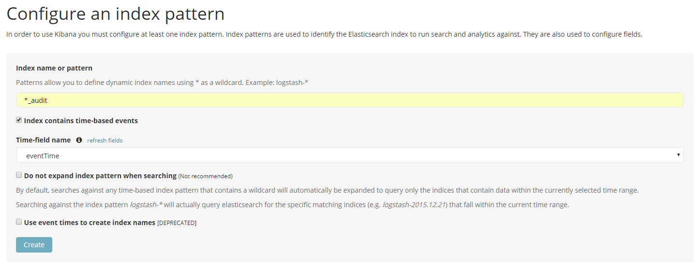
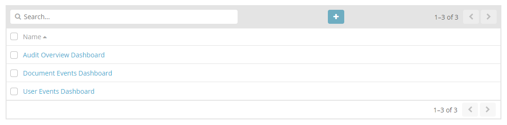
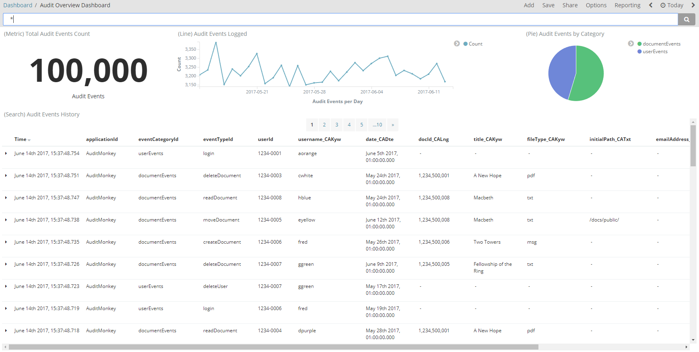
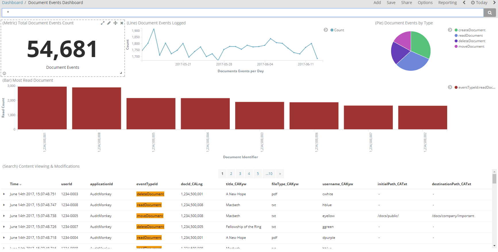
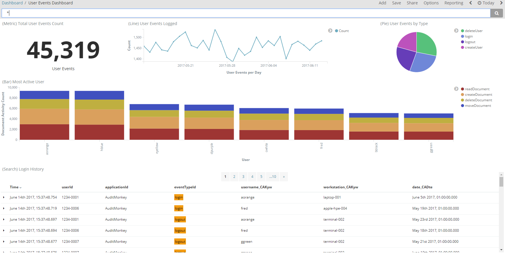

# Kibana Reporting

[Kibana](https://www.elastic.co/products/kibana/) provides reporting capability for audit event data indexed into Elasticsearch. It is a browser based analytics and visualization platform  which can be used to search, view, and interact with the audit data stored in Elasticsearch indices. Kibana provides the ability to perform data analysis and visualize this audit data in a variety of charts, tables, and maps.

## Getting Started

You need to perform the following steps to get started with Kibana reporting.

1. Use the [Audit Service Deploy](https://github.com/CAFAudit/audit-service-deploy) Project to deploy the Elasticsearch cluster and Kibana.
2. Utilise the [Audit Monkey](https://github.com/CAFAudit/audit-service/tree/develop/caf-audit-monkey) to send audit event messages to Elasticsearch.
3. Define an index pattern in Kibana. 
4. Import the set of [saved dashboards, saved searches and visualizations](https://github.com/CAFAudit/audit-service-deploy/blob/develop/kibana/saved-objects.json) into Kibana which can be used to explore and visualize the audit data in several ways.
5. Explore and visualize the audit event messages using Kibana dashboards.

These steps are explained in more detail in subsequent sections:

- [Deploying Elasticsearch and Kibana](#deploying-elasticsearch-and-kibana)
- [Loading a Sample Data Set into Elasticsearch](#loading-a-sample-data-set-into-elasticsearch)
- [Defining an Index Pattern in Kibana](#defining-an-index-pattern-in-kibana)
- [Importing Saved Objects into Kibana](#importing-saved-objects-into-kibana)
- [Exploring and Visualizing the Sample Data Set](#exploring-and-visualizing-the-sample-data-set)

## Deploying Elasticsearch and Kibana
For developer deployments of Elasticsearch and Kibana, please follow the Audit Service Deployment [documentation](https://github.com/CAFAudit/audit-service-deploy). This includes configuration and running guidelines for the Audit Web Service, Elasticsearch cluster and Kibana in Docker.

## Loading a Sample Data Set into Elasticsearch
The Audit Monkey can be used to generate and send significant volumes of audit event messages to Elasticsearch. Configuration and usage instructions are provided [here](https://github.com/CAFAudit/audit-service/tree/develop/caf-audit-monkey). For the purposes of demonstrating Kibana reporting capability, the Audit Monkey should be run in **[demo]** mode.

## Defining an Index Pattern in Kibana
Before you can start using Kibana, you need to tell it which Elasticsearch indices you want to explore. The first time you access Kibana, you are prompted to define an index pattern that matches the name of one or more of your indices. To configure which Elasticsearch indices you want to access, follow the steps below:

1. Point your browser at port 5601 to access the Kibana UI. For example, `localhost:5601` or `http://YOURDOMAIN.com:5601`.

	

2. Specify an index pattern that matches the name of one or more of the Elasticsearch indices generated as a result of running the Audit Monkey to send audit event messages to Elasticsearch. Set this index pattern to `*_audit`. Kibana will then support the exploration of all indices created via the Audit Monkey usage.
3. Select an index field that contains the timestamp that you want to use to perform time-based comparisons in Kibana. You should select the `eventTime` field indexed into Elasticsearch for each new audit event message.

## Importing Saved Objects into Kibana
The [Audit Service Deploy](https://github.com/CAFAudit/audit-service-deploy) Project comprises a set of saved dashboards, saved searches and visualizations that can be imported into Kibana in order to explore and visualize the audit event messages in a variety of ways. Import instructions are provided next:

1. In Kibana, select the **Management** view and click on **Saved Objects**.
2. In the **Edit Saved Objects** section, click on **Import** to navigate to the JSON file representing the set of [saved objects](https://github.com/CAFAudit/audit-service-deploy/blob/develop/kibana/saved-objects.json) to import.
3. Click **Open** after selecting the JSON file.
4. Select the **Dashboard** view in Kibana and 3 new dashboards should be added.
	

## Exploring and Visualizing the Sample Data Set
You can begin to explore and visualize the audit event messages indexed into Elasticsearch using the new dashboards.

### Audit Overview Dashboard
The Audit Overview Dashboard displays a collection of visualizations and a saved search to present a summary of all audit events indexed into Elasticsearch. 

The dashboard includes:

- a Metric visualization displaying the total number of audit event messages indexed into Elasticsearch
- a Line Chart visualization showing a count of audit event messages indexed on a daily basis
- a Pie Chart visualization illustrating a breakdown of all audit event messages by category
- a Saved Search presenting a record of all audit events indexed into Elasticsearch

As illustrated, audit events are categorized by document and user events only.

### Document Events Dashboard
The Document Events Dashboard displays a collection of visualizations and a saved search to present a summary of all document events indexed into Elasticsearch. 

The dashboard includes:

- a Metric visualization displaying the total number of document event messages indexed into Elasticsearch
- a Line Chart visualization showing a count of document event messages indexed on a daily basis
- a Pie Chart visualization illustrating a breakdown of document event messages by event type
- a Saved Search reporting requests to view and modify document content

### User Events Dashboard
The User Events Dashboard displays a collection of visualizations and a saved search to present a summary of all user events indexed into Elasticsearch. 

The dashboard includes:

- a Metric visualization displaying the total number of user event messages indexed into Elasticsearch
- a Line Chart visualization showing a count of user event messages indexed on a daily basis
- a Pie Chart visualization illustrating a breakdown of user event messages by event type
- a Saved Search reporting login history

---
