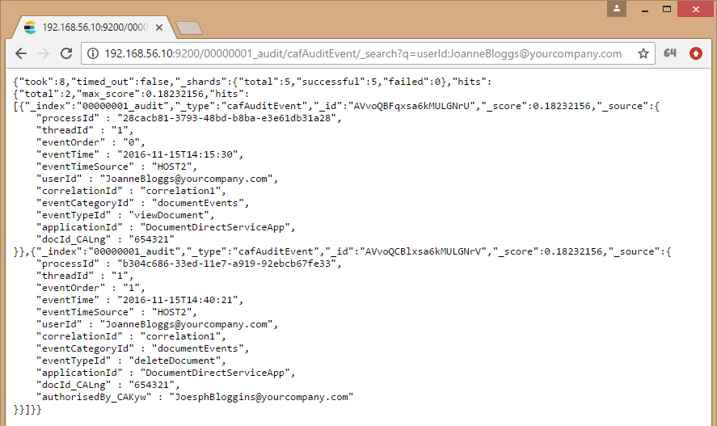

# Web Service

The Audit Web Service API provides a RESTful interface for indexing audit event messages into Elasticsearch. Audit events, in the form of REST POST JSON requests, are sent to the Audit Web Service API which then connects to Elasticsearch and indexes the details of the audit event message for the tenant application.

As a type-safe alternative to invoking the Audit Web Service REST API directly, the Auditing Library offers an Audit Web Service Client mode for building and sending audit events to the Audit Web Service REST API.

## Deploying the Audit Web Service

For developer deployments of the Audit Web Service and Elasticsearch, please follow the Audit Service Deployment documentation. The documentation covers configuring and starting of the Audit Web Service and Elasticsearch cluster in Docker. For more information on Audit Service Deployment, go [here](https://github.com/CAFAudit/audit-service-deploy).

## Using the Audit Web Service

The Audit Web Service offers a Swagger UI or REST API for sending audit events.

### Swagger UI

The Audit Web Service is a RESTful Web Service and is primarily intended for programmatic access, however it also ships with a Swagger-generated user-interface that enables the creation of audit events for the purposes of understanding and verifying the set-up of the service.

Using a web browser, the Audit Web Service Swagger UI is reachable via `http://<Audit_Web_Service_Host>:<Port>/caf-audit-service-ui` URL.

The `/auditevents` operation provides the ability to send an audit event to the Audit Web Service which then stores that audit event in Elasticsearch. The audit event definition JSON schema is provided in the UI, under the Data Type column, and should be used as a reference when constructing the audit event message to send through the Web Service.

The following image is a screenshot of the Audit Web Service Swagger UI with an example audit event that matches the JSON input schema. 

Use the "Try it out!" button to send an audit event to the Audit Web Service. You can verify that the event message was stored in Elasticsearch by following the [Verification Instructions](#verification-instructions).

### REST API

The Audit Web Service API POST endpoint for sending an audit event message is reachable at `http://<Audit_Web_Service_Host>:<Port>/caf-audit-service/v1/auditevents`. It takes audit event messages as JSON input; the schema is as follows:

    {
      "applicationId": "string",
      "processId": "string",
      "threadId": 0,
      "eventOrder": 0,
      "eventTime": "string",
      "eventTimeSource": "string",
      "userId": "string",
      "tenantId": "string",
      "correlationId": "string",
      "eventTypeId": "string",
      "eventCategoryId": "string",
      "eventParams": [
        {
          "paramName": "string",
          "paramType": "string",
          "paramIndexingHint": "fulltext",
          "paramColumnName": "string",
          "paramValue": "string"
        }
      ]
    }

The following CURL command sends an audit event message to the Audit Web Service `/auditevents` API POST endpoint:

    curl --request POST \
      --url http://<Audit_Web_Service_Host>:<Port>/caf-audit-service/v1/auditevents \
      --header 'content-type: application/json' \
      --data '{"applicationId":"SampleApp","processId":"c5f2dfbf-528e-4630-ba6c-3d5fe40cc498","threadId":1,"eventOrder":0,"eventTime":"2017-05-25T11:36:38.544Z","eventTimeSource":"HOST1","userId":"JoeBloggs@yourcompany.com","tenantId":"00000001","correlationId":"correlation1","eventTypeId":"deleteDocument","eventCategoryId":"documentEvents","eventParams":[{"paramName":"docId","paramType":"long","paramColumnName":null,"paramValue":"123456"},{"paramName":"authorisedBy","paramType":"string","paramIndexingHint":"keyword","paramValue":"JoesphBloggins@yourcompany.com","paramColumnName":null}]}'

You can verify that the event message was stored in Elasticsearch by following the [Verification Instructions](verification-instructions).

## Audit Web Service Client

The Audit Library can be used in your audited Java application for building and sending audit event messages to the Audit Web Service.

### Generating a Client-side Auditing Library

The Getting Started guide's [Writing an Application Audit Event Definition File](Getting-Started#writing-an-application-audit-event-definition-file) and [Generating a Client-side Auditing Library](Getting-Started#generating-a-client-side-auditing-library) sections cover the generation of a type-safe client-side auditing library. Generating a client-side auditing library offers a type-safe alternative to invoking the auditing library's event builder or the Audit Web Service REST API.

### Using the Audit Web Service Client

Once you have your auditing library (generated or `caf-audit`), you use it to send audit events to the Audit Web Service.

#### Dependencies

If you generated a client-side library it should be referenced in the normal way in the application's POM file. You shouldn't need to manually add a dependency on `caf-audit` as it will be a transitive dependency of the generated library.

#### Audit Connection

Regardless of whether you choose to use a generated client-side library, or to use `caf-audit` directly, you must first create an `AuditConnection` object.

This object represents a logical connection to an endpoint which, in this case, is the Audit Web Service. It is a thread-safe object. ***Please take into account that this object requires some time to construct. The application should hold on to it and re-use it, rather than constantly re-construct it.***

The `AuditWebServiceClientConnection` object, which is the `AuditConnection` object implementation for creating a connection to the Audit Web Service, can be constructed using the static `createConnection()` method in the `AuditConnectionFactory` class. This method takes a `ConfigurationSource` parameter, which is the standard method of configuration in CAF. To enable the creation of the `AuditWebServiceClientConnection` object, with the `AuditConnectionFactory`, the `CAF_AUDIT_MODE` environment variable must be set to `webservice`.

##### ConfigurationSource

[comment]: <> (The caf-audit Client-API.md documentation content contains duplication of the ConfigurationSource section. It is important that any changes here must also be included within the Client-API.md content.)

You may already have a CAF configuration source in your application. It is a general framework that abstracts the source of the configuration, allowing it to come from any of the following:

* environment variables
* files
* a REST service
* a custom source that better integrates with the host application.

If you're not already using CAF's configuration mechanism, this sample code illustrates the generation of a ConfigurationSource object.

	import com.hpe.caf.api.*;
	import com.hpe.caf.cipher.NullCipherProvider;
	import com.hpe.caf.config.system.SystemBootstrapConfiguration;
	import com.hpe.caf.naming.ServicePath;
	import com.hpe.caf.util.ModuleLoader;
	
	public static ConfigurationSource createCafConfigSource() throws Exception
	{
	    System.setProperty("CAF_CONFIG_PATH", "/etc/sampleapp/config");
	    System.setProperty("CAF_APPNAME", "sampleappgroup/sampleapp");
	
	    BootstrapConfiguration bootstrap = new SystemBootstrapConfiguration();
	    Cipher cipher = ModuleLoader.getService(CipherProvider.class, NullCipherProvider.class).getCipher(bootstrap);
	    ServicePath path = bootstrap.getServicePath();
	    Codec codec = ModuleLoader.getService(Codec.class);
	    return ModuleLoader.getService(ConfigurationSourceProvider.class).getConfigurationSource(bootstrap, cipher, path, codec);
	}

To compile the above sample code, add the following dependencies to your POM:

	<dependency>
	    <groupId>com.github.cafapi</groupId>
	    <artifactId>caf-api</artifactId>
	    <version>1.6.0-176</version>
	</dependency>
	<dependency>
	    <groupId>com.github.cafapi.cipher</groupId>
	    <artifactId>cipher-null</artifactId>
	    <version>1.6.0-176</version>
	</dependency>
	<dependency>
	    <groupId>com.github.cafapi.config</groupId>
	    <artifactId>config-system</artifactId>
	    <version>1.6.0-176</version>
	</dependency>
	<dependency>
	    <groupId>com.github.cafapi.util</groupId>
	    <artifactId>util-moduleloader</artifactId>
	    <version>1.6.0-176</version>
	</dependency>
	<dependency>
	    <groupId>com.github.cafapi.util</groupId>
	    <artifactId>util-naming</artifactId>
	    <version>1.6.0-176</version>
	</dependency>

To use JSON-encoded files for your configuration, add the following additional dependencies to your POM:

	<!-- Runtime-only Dependencies -->
	<dependency>
	    <groupId>com.github.cafapi.config</groupId>
	    <artifactId>config-file</artifactId>
	    <version>1.6.0-176</version>
	    <scope>runtime</scope>
	</dependency>
	<dependency>
	    <groupId>com.github.cafapi.codec</groupId>
	    <artifactId>codec-json</artifactId>
	    <version>1.6.0-176</version>
	    <scope>runtime</scope>
	</dependency>
	<dependency>
	    <groupId>io.dropwizard</groupId>
	    <artifactId>dropwizard-core</artifactId>
	    <version>0.8.4</version>
	    <scope>runtime</scope>
	</dependency>

##### Configuration Required for the AuditConnection

In the `ConfigurationSource` above, we used JSON-encoded files with the following parameters:

- `CAF_CONFIG_PATH: /etc/sampleapp/config`
- `CAF_APPNAME: sampleappgroup/sampleapp`

Given this configuration, you would configure Auditing by creating a file named `cfg_sampleappgroup_sampleapp_WebSerivceClientAuditConfiguration` in the `/etc/sampleapp/config/` directory. The contents of this file should be similar to the following:

	{
	    "webServiceEndpoint": "http://<Audit_Web_Service_Node>:<Port>/caf-audit-service/v1"
	}

where:

- `webServiceEndpoint` refers to the Audit Web Service endpoint.

#### Audit Channel

After you successfully construct an `AuditConnection` object, you must then create an `AuditChannel` object.

This object represents a logical channel to an endpoint which, in this case, is the Audit Web Service. **It is NOT a thread-safe object and must not be shared across threads without synchronization.** However, you will have no issue constructing multiple `AuditChannel` objects simultaneously on different threads. The objects are lightweight and caching them is not that important.

The `AuditChannel` object can be constructed using the `createChannel()` method on the `AuditConnection` object. It does not take any parameters.

#### Audit Log

The generated library contains an `AuditLog` class, which contains static methods used to log audit events.

Import the `AuditLog` class belonging to the package name of the project that generated it for your application.

The following is an example for a SampleApp's `viewDocument` event, which takes a single document identifier parameter:

	/**
	 * Audit the viewDocument event
	 * @param channel Identifies the channel to be used for message queuing 
	 * @param tenantId Identifies the tenant that the user belongs to 
	 * @param userId Identifies the user who triggered the event 
	 * @param correlationId Identifies the same user action 
	 * @param docId Document Identifier 
	 */
	public static void auditViewDocument
	(
	    final AuditChannel channel,
	    final String tenantId,
	    final String userId,
	    final String correlationId,
	    final long docId
	)
	    throws Exception
	{
	    final AuditEventBuilder auditEventBuilder = channel.createEventBuilder();
	    auditEventBuilder.setApplication(APPLICATION_IDENTIFIER);
	    auditEventBuilder.setTenant(tenantId);
	    auditEventBuilder.setUser(userId);
	    auditEventBuilder.setCorrelationId(correlationId);
	    auditEventBuilder.setEventType("documentEvents", "viewDocument");
	    auditEventBuilder.addEventParameter("docId", null, docId);
	
	    auditEventBuilder.send();
	}

The name of the event is included in the generated method name. In addition to the custom parameters (document id in this case), the caller must pass the `AuditChannel` object to be used, as well as the tenant id, user id, and correlation id.

The method will throw an exception if the audit event could not be stored for some reason (for example, network failure or supplying unsupported tenantId characters).

## Verification Instructions

Every time the Audit Web Service REST API or an `AuditLog` method is called, a new application audit event is sent to the Audit Web Service and entered into the tenant's Elasticsearch index. 

Elasticsearch offers a RESTful interface for querying index entries. For more information on the Elasticsearch REST Search API, go [here](https://www.elastic.co/guide/en/elasticsearch/reference/current/search.html).

The following Search API operation, `http://<Elasticsearch_Cluster_Node1>:<ES_Port_Node1>/00000001_audit/cafAuditEvent/_search`, can be run to display all audit event entries belonging to tenantId `00000001`:

The following Search API operation, `http://<Elasticsearch_Cluster_Node1>:<ES_Port_Node1>/00000001_audit/cafAuditEvent/_search?q=userId:JoanneBloggs@yourcompany.com`, can be run to display the audit event entries belonging to tenantId `00000001` and whose `userId` is `JoanneBloggs@yourcompany.com`:

---